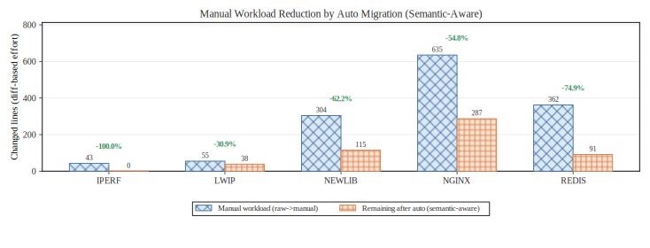
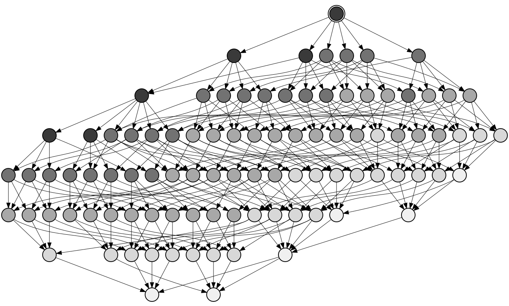
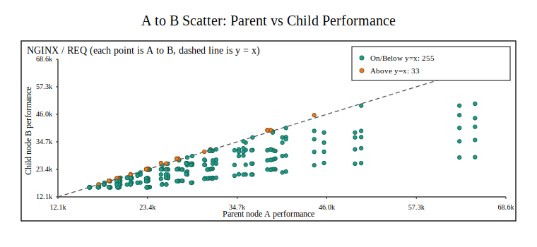
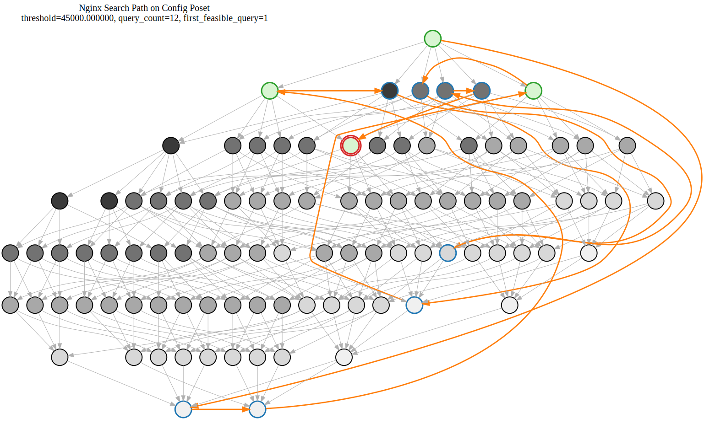
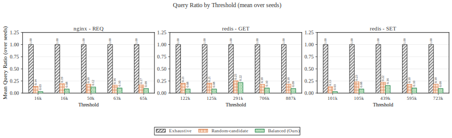
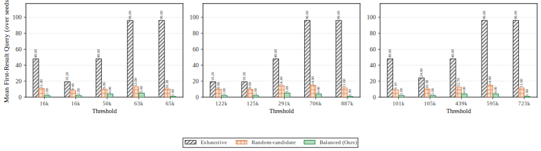
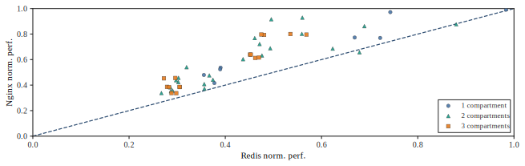

# AutoFlex: 面向 FlexOS 的自动化迁移与安全配置搜索

本仓库聚焦 FlexOS 生态中的两类关键问题：

1. 自动化代码迁移：将应用迁移到 FlexOS gate 机制时，如何系统降低人工改写成本。
2. 安全配置搜索：在隔离强度与性能约束之间，如何高效探索大规模配置空间并输出可行前沿。

工程上，自动迁移主线位于 [autoGen](autoGen)，安全配置搜索主线位于 [search](search)。

## 研究背景与目标

FlexOS 通过可组合的隔离机制打开了安全/性能联合优化空间，但也带来两类现实门槛：

1. 迁移门槛：旧代码向 gate 调用范式迁移时，人工改写成本高且容易遗漏。
2. 搜索门槛：配置空间随隔离特征组合指数增长，直接穷举成本极高。

本项目的目标是提供一套可复现、可度量的工程路径：

1. 用规则驱动迁移流水线提升 gate 覆盖率并量化人工工作量下降。
2. 用偏序图与假设驱动搜索降低查询成本，在性能阈值下逼近最强隔离配置。

## 核心创新点

### 1. 规则驱动的自动迁移流水线

基于 [autoGen/flexos_porthelper_py.py](autoGen/flexos_porthelper_py.py) 与规则文档 [autoGen/AUTO_MIGRATION_RULES.md](autoGen/AUTO_MIGRATION_RULES.md)，迁移流程由三层组成：

1. 函数到库映射：结合 cscope 与显式 fallback 映射 gate 目标库。
2. Coccinelle 基础替换：覆盖赋值调用与纯调用两类常见模式。
3. 语句级后处理重写：补齐 if/return/cast 等复杂语法形态。

该设计把“可自动化”的迁移模式显式化，并允许对规则命中与漏改进行版本化统计。

### 2. 偏序建模与期望剪枝搜索

基于 [search/dag_poset_search.py](search/dag_poset_search.py) 与实验说明 [search/EXPERIMENT_BASELINE_GUIDE.md](search/EXPERIMENT_BASELINE_GUIDE.md)，配置空间被建模为 DAG 偏序图：

1. 节点表示一个隔离配置。
2. 有向边表示更强隔离关系。
3. 查询后按祖先/后代闭包进行批量剪枝。

balanced 策略以期望剪枝量为优化目标，核心思想是最大化：

$$
E_i = p\cdot a_i + (1-p)\cdot d_i
$$

其中 $a_i$ 为候选集中祖先规模， $d_i$ 为候选集中后代规模， $p$ 为在线估计的可行概率。

### 3. 统一绘图编排

本仓库所有绘图统一由根目录脚本 [generate_figure.py](generate_figure.py) 调度，配置在 [plot-config.yaml](plot-config.yaml)。

说明：历史 Makefile 绘图路径已淘汰，不作为推荐流程。

## 仓库结构

- [autoGen](autoGen): 自动迁移规则、评测脚本、评测结果与工作量分析。
- [search](search): 配置偏序建模、搜索策略、baseline 评估与可视化脚本。
- [asplos22-ae](asplos22-ae): 原始实验准备与运行框架（用于采样与实验执行）。
- [figures](figures): 统一归档的图表输出（svg/png）。
- [PLOTTING_GUIDE.md](PLOTTING_GUIDE.md): 统一绘图流程与图表说明。

## Web 自动化平台（启动、使用、日志与产物）


### Web 平台一览

| 类别 | 步骤/功能 | 说明 |
|------|-----------|------|
| 启动 | 1. 启动服务 | `fuser -k 8080/tcp && cd website && .venv/bin/python app.py` |
|      | 2. 访问页面 | http://127.0.0.1:8080/ |
| 页面结构 | 左侧：Stage A | 上传原始源码 zip，自动迁移 |
|      | 左侧：Stage B | 上传迁移后源码 zip，选择 test bench/参数，配置搜索 |
|      | 左侧：产物下载 | 下载当前作业产物 |
|      | 右侧：Job Console | 作业状态、详情、日志、单删/批量删 |
|      | 顶栏 | 刷新、帮助（内置文档） |
| Stage A 流程 | 1. 上传源码 zip | |
|      | 2. 开始迁移 | |
|      | 3. 查看日志/详情 | |
|      | 4. 下载 migrated_source.zip | 用于 Stage B |
| Stage B 流程 | 1. 上传 migrated_source.zip | |
|      | 2. 选择 test bench | 如 fig06-nginx/fig06-redis |
|      | 3. 配置参数 | baseline_threshold/num_compartments/host_cores/wayfinder_cores/test_iterations/top_k |
|      | 3.1 bench 可扩展 | 每个 bench 可在 `website/config/test_benches/*.json` 定义 `runner_script`/`runner_args` 指定具体测试脚本 |
|      | 4. 开始搜索 | |
|      | 5. 下载产物 | |
| 日志与作业 | 状态 | queued/running/succeeded/failed |
|      | 详情字段 | command/params/return_code/error |
|      | 日志建议 | 优先看首条硬错误，结合 command/params/log 定位 |
| 产物说明 | benchmark_nginx.csv | 基准数据，统计/绘图用 |
|      | build_and_test.log | 构建与测试日志 |
|      | performance_report.json | 机器可读摘要 |
|      | performance_report.md | 人类可读报告 |
|      | search_progress.csv | 搜索轨迹数据 |
|      | top_images.tar.gz | 镜像与相关文件归档 |
|      | top_images/task-single/build.log | 单配置构建日志 |
|      | top_images/task-single/config | 运行配置快照 |
|      | top_images/task-single/kraft.yaml | 构建关键配置 |
|      | top_images/task-single/nginx_kvm-x86_64(.dbg) | 产出二进制/调试版 |
| 维护 | 重启服务 | 同启动命令 |
|      | 重启后 | 已完成作业恢复，running 标记为 failed |
|      | 清理作业 | 支持单个/批量删除 |
| 论文推荐流程 | 1. 启动服务 | |
|      | 2. Stage A 上传源码 zip | |
|      | 3. 观察日志/详情 | |
|      | 4. 下载 migrated_source.zip | |
|      | 5. Stage B 上传 migrated_source.zip | |
|      | 6. 选择 test bench/参数 | |
|      | 7. 开始搜索 | |
|      | 8. 下载关键产物 | benchmark_nginx.csv/performance_report.json/md/search_progress.csv/top_images.tar.gz |
|      | 9. 归档 | CSV/报告/命令/参数/日志/产物 |
| 常见问题 | 页面不更新 | 刷新页面，确认 8080 端口 |
|      | Stage B 失败 | 先查 build_and_test.log 首条硬错误，再查 command/params |
|      | 产物为空 | 检查 job_id，failed 作业无完整产物 |


## 实验设计

### A. 自动迁移实验设计

数据与评测来自 [autoGen/eval_results/flexos_py_plus_v11](autoGen/eval_results/flexos_py_plus_v11)。

1. 覆盖率口径（gate 对齐）
- expected_calls: manual 中目标 gate 调用数。
- matched_calls: auto 与 manual 对齐命中数。
- unresolved_calls: 未对齐调用数。

2. 人工工作量口径（语义差异）
- total_manual_changed_lines
- remaining_changed_lines
- reduction_pct

3. 应用范围
- nginx, redis, lwip, newlib, iperf

### B. 安全配置搜索实验设计

实验协议与指标定义见 [search/EXPERIMENT_BASELINE_GUIDE.md](search/EXPERIMENT_BASELINE_GUIDE.md)。

1. 数据集
- nginx:REQ
- redis:GET
- redis:SET

2. 对比方法
- exhaustive
- random
- balanced（ours）

3. 指标
- query_ratio: 查询比例（query_count / |V|）
- first_result_query_ratio: 首次命中最优前沿的归一化查询位置

4. 假设验证
- 单调性假设：隔离增强通常导致性能下降。
- 异常配置对统计见 [figures/search/hypothesis_violate_report.md](figures/search/hypothesis_violate_report.md) 与 [figures/search/hypothesis_all_violations.csv](figures/search/hypothesis_all_violations.csv)。

## 关键实验结果

### 1. 自动迁移结果

来自 [autoGen/eval_results/flexos_py_plus_v11/summary.json](autoGen/eval_results/flexos_py_plus_v11/summary.json)：

- expected_calls = 81
- matched_calls = 81
- unresolved_calls = 0

来自 [autoGen/eval_results/flexos_py_plus_v11/manual_effort_diff_stats.csv](autoGen/eval_results/flexos_py_plus_v11/manual_effort_diff_stats.csv)：

- nginx: reduction_pct = 54.80%
- redis: reduction_pct = 74.86%
- newlib: reduction_pct = 62.17%
- lwip: reduction_pct = 30.91%
- iperf: reduction_pct = 100.00%

图示（自动迁移后人工工作量下降）：



### 2. 配置搜索结果

核心图表如下：

1. 配置偏序关系图（图 8a）



2. 假设验证散点（图 8b 示例）



3. Nginx 搜索路径（图 8c）



4. baseline 综合对比（查询比例与首次命中）





### 3. ASPLOS 关键性能图入口

本仓库已整理对应输出目录，示例：

- figure06: [figures/figure06](figures/figure06)
- figure07: [figures/figure07](figures/figure07)
- figure09: [figures/figure09](figures/figure09)

示例图：



## 复现指南

### 0. 复现入口优先级（AE 推荐）

建议按以下优先级使用入口，避免流程混杂：

1. **统一出图入口（推荐）**：`generate_figure.py`
2. **模块一体化入口**：`search/run_debug_generate.sh`、`autoGen/evaluate_flexos_porthelper_py.py`
3. **原始 AE 采样入口**：`asplos22-ae/Makefile`
4. **作业化入口（Web）**：`website/app.py`
5. **调试/维护入口**：各目录 `scripts/` 与实验内 `build/test/start-scripts`

### 1. 主流程 A（论文 AE 复现，CLI 推荐）

#### Step A1: 原始实验准备与采样（asplos22-ae）

```bash
export KRAFT_TOKEN="<your_github_token>"
cd asplos22-ae
make dependencies
make prepare
make run
```

按图号局部执行示例：

```bash
cd asplos22-ae
make prepare-fig-06 && make run-fig-06
make prepare-fig-09 && make run-fig-09
```

#### Step A2: 根目录统一出图（推荐）

```bash
cd /home/tibless/Desktop/auto_flex
python3 generate_figure.py --list
python3 generate_figure.py --all
```

按目标出图示例：

```bash
python3 generate_figure.py --target search
python3 generate_figure.py --target auto_migration_effort
python3 generate_figure.py --target figure06 --target figure07 --target figure09
```

### 2. 主流程 B（search 一体化）

```bash
PYTHON_BIN="$PWD/.venv/bin/python" \
PNG_DPI=300 \
OUTPUT_DIR="$PWD/figures/search" \
bash search/run_debug_generate.sh
```

该流程会串行执行偏序图构建、假设验证、DAG 搜索、baseline 评估与多组对比绘图。

### 3. 主流程 C（autoGen 一体化）

```bash
$PWD/.venv/bin/python autoGen/evaluate_flexos_porthelper_py.py \
  --dataset-root autoGen/dataset \
  --out-dir autoGen/eval_results/flexos_py_plus_v11

$PWD/.venv/bin/python autoGen/compute_rule_match_stats.py \
  --eval-dir autoGen/eval_results/flexos_py_plus_v11

$PWD/.venv/bin/python autoGen/plot_manual_effort_reduction.py \
  --eval-dir $PWD/autoGen/eval_results/flexos_py_plus_v11 \
  --formats svg png \
  --output-root figures/autogen
```

单文件迁移+检测（可选）：

```bash
bash autoGen/flexos_migrate_vuln_pipeline.sh \
  --target-file autoGen/third_party/unikraft/lib/uktime/time.c
```

### 4. 主流程 D（Web 作业化复现）

```bash
cd website
bash scripts/setup_links.sh
python3 -m pip install -r requirements.txt
python3 app.py
```

访问 `http://127.0.0.1:8080/`，通过页面执行：

1. Stage A（自动迁移）：后端执行 `website/scripts/run_code_porting_from_zip.py`
2. Stage B（配置搜索）：后端执行 `website/scripts/run_config_search_nginx_from_zip.py`

### 5. 全工程目录覆盖与脚本索引（主表）

| 目录 | 角色 | 推荐入口 | 相关脚本类型 |
|---|---|---|---|
| `.` | 总调度层 | `generate_figure.py` | Python、Shell、YAML、Make 模板 |
| `autoGen/` | 自动迁移与评测 | `evaluate_flexos_porthelper_py.py` | Python、Shell |
| `search/` | 偏序搜索与分析绘图 | `run_debug_generate.sh` | Python、Shell |
| `website/` | Web 作业平台 | `app.py` | Python、Shell |
| `asplos22-ae/` | 原始 AE 采样框架 | `Makefile` | Makefile、Python、Shell |
| `drawio/` | 图形草图生成 | `draw.py` | Python |
| `paper/` | 论文编译 | `Makefile` | Makefile、Python |
| `figures/` | 图表产物归档 | 无执行脚本 | 结果目录 |
| `debug_log/` | 运行日志文档 | 无执行脚本 | Markdown 文档 |
| `.debugs/` | 临时调试脚本 | `plot_matched_calls_diff.py` | Python（debug） |

### 6. 分目录脚本清单（全量）

#### 6.1 根目录（调度与配置）

| 脚本/文件 | 分类 | 作用 | 典型命令 |
|---|---|---|---|
| `generate_figure.py` | Recommended | 全仓统一绘图调度（读取 `plot-config.yaml`） | `python3 generate_figure.py --all` |
| `generate_all_plots.sh` | Optional | `generate_figure.py --all` 封装 | `bash generate_all_plots.sh` |
| `plot-config-tool.py` | Optional | 查看/初始化绘图配置项 | `python3 plot-config-tool.py list` |
| `plot-config.yaml` | Recommended | 目标绘图命令与收集规则配置 | 编辑后配合 `generate_figure.py` |
| `plot.mk` | Optional | 通用绘图 Makefile 模板 | 作为 include 模板使用 |

#### 6.2 autoGen（自动迁移）

| 脚本 | 分类 | 作用 | 典型命令 |
|---|---|---|---|
| `autoGen/flexos_porthelper_py.py` | Recommended | 单文件迁移（cscope+spatch+后处理） | `python3 autoGen/flexos_porthelper_py.py --source-root ... --target-file ...` |
| `autoGen/evaluate_flexos_porthelper_py.py` | Recommended | 批量评测 auto/manual 对齐并输出 summary | `python3 autoGen/evaluate_flexos_porthelper_py.py --dataset-root autoGen/dataset --out-dir autoGen/eval_results/flexos_py_plus_v11` |
| `autoGen/compute_rule_match_stats.py` | Recommended | 统计规则级 `(lib,function)` 命中 | `python3 autoGen/compute_rule_match_stats.py --eval-dir autoGen/eval_results/flexos_py_plus_v11` |
| `autoGen/plot_manual_effort_reduction.py` | Recommended | 输出人工工作量下降图 | `python3 autoGen/plot_manual_effort_reduction.py --eval-dir ... --output-root figures/autogen` |
| `autoGen/flexos_migrate_vuln_pipeline.sh` | Optional | 迁移+仪器化+运行时 gate 检查+漏洞扫描 | `bash autoGen/flexos_migrate_vuln_pipeline.sh --target-file ...` |

#### 6.3 search（配置搜索）

| 脚本 | 分类 | 作用 |
|---|---|---|
| `search/run_debug_generate.sh` | Recommended | 全流程总入口（构图/验证/搜索/评估/绘图） |
| `search/fig08_build_poset_python.py` | Recommended | 根据 config-map 重建偏序图 DOT/SVG/PNG |
| `search/validate_all_hypothesis.py` | Recommended | 批量验证假设并生成 violations 与散点图 |
| `search/dag_poset_search_cli.py` | Recommended | 运行 DAG 搜索并输出 summary/trace |
| `search/evaluate_search_baselines_multi.py` | Recommended | 多阈值多种子 baseline 评估 |
| `search/plot_search_baseline_multi_metric.py` | Recommended | 聚合指标对比图 |
| `search/plot_search_baseline_by_threshold.py` | Recommended | 分阈值面板图 |
| `search/select_useful_thresholds_for_ours.py` | Optional | 筛选重点阈值生成 focus 子集 |
| `search/fig08_plot_nginx_search_path.py` | Optional | nginx 搜索路径图 |
| `search/epsilon_exceedance_stats.py` | Optional | 异常边 exceedance 统计 |
| `search/hypothesis.py` | Optional | 单次假设验证 CLI |
| `search/plot_search_baseline_comparison.py` | Optional | 旧版 summary 对比图 |
| `search/plot_single_query_pruning.py` | Optional | 单查询剪枝示意图 |
| `search/fig08_plot.sh` | Debug/Maintenance | 用 graphviz 直接渲染 fig08 DOT |

快速运行（单脚本）示例：

```bash
python3 search/dag_poset_search_cli.py --threshold-list "[45000,302000,140200]"
python3 search/validate_all_hypothesis.py --out-dir figures/search
```

#### 6.4 website（Web 平台与作业后端）

| 脚本 | 分类 | 作用 |
|---|---|---|
| `website/app.py` | Recommended | Flask 作业平台，提供 Stage A/B API 与日志流 |
| `website/scripts/setup_links.sh` | Recommended | 创建 `website/linked` 到项目主目录软链接 |
| `website/scripts/run_code_porting_from_zip.py` | Recommended | Stage A：zip 输入 -> migrated_source + report |
| `website/scripts/run_config_search_nginx_from_zip.py` | Recommended | Stage B：zip 输入 -> build/test/search + artifacts |
| `website/scripts/run_wayfinder_build_from_zip.sh` | Optional | Wayfinder 覆盖构建辅助脚本 |
| `website/scripts/debug_blank_page.py` | Debug/Maintenance | Playwright 空白页诊断脚本 |

#### 6.5 asplos22-ae（原始实验框架）

**顶层编排**

| 文件 | 分类 | 作用 |
|---|---|---|
| `asplos22-ae/Makefile` | Recommended | `dependencies/prepare/run/plot/clean` 与按图号目标编排 |

**各实验目录入口**

| 实验目录 | 入口 | 说明 |
|---|---|---|
| `fig-06_nginx-redis-perm` | `Makefile` + `apps/*/{build.sh,test.sh,plot.py}` + `plot_fig06.py` | Wayfinder 任务生成、构建、测试、拆分图输出 |
| `fig-07_nginx-redis-normalized` | `Makefile` + `plot_fig07.py` + `plot_scatter.py` | 基于 fig06 数据生成标准化散点图 |
| `fig-09_iperf-throughput` | `Makefile` + `plot_fig09.py` + `docker-data/*.sh` | iPerf 构建/运行/启动脚本 |
| `fig-10_sqlite-exec-time` | `Makefile` + `docker-data/run.sh` + `docker-data/start-scripts/*.sh` | SQLite 多后端 benchmark |
| `fig-11_flexos-alloc-latency` | `Makefile` + `docker-data/run.sh` + `toggle-kpti.sh` + `tools/benchmark_linux.sh` | 微基准 + KPTI on/off 测量 |
| `tab-01_porting-effort` | `Makefile` | Porting effort 手动测量容器环境 |

**辅助脚本**

| 脚本 | 分类 | 作用 |
|---|---|---|
| `asplos22-ae/scripts/fig06/nginx_watch.sh` | Debug/Maintenance | 检查 nginx Wayfinder 结果目录可执行产物完整性 |
| `asplos22-ae/scripts/fig06/redis_watch.sh` | Debug/Maintenance | 检查 redis Wayfinder 结果目录可执行产物完整性 |
| `asplos22-ae/scripts/fig06/csv_tab.sh` | Debug/Maintenance | CSV 快速对齐显示 |

#### 6.6 drawio 与 paper

| 路径 | 分类 | 作用 | 典型命令 |
|---|---|---|---|
| `drawio/draw.py` | Optional | Graphviz 生成紧凑剪枝示意图 | `python3 drawio/draw.py` |
| `paper/drawio/draw.py` | Optional | 论文目录中的同类绘图脚本 | `python3 paper/drawio/draw.py` |
| `paper/Makefile` | Recommended | `xelatex -> bibtex -> xelatex*2` 编译论文 | `cd paper && make pdf` |

### 7. 目录边界与无脚本目录说明

以下目录主要存放结果或文档，本身不提供执行脚本：

1. `figures/`：统一图表输出归档。
2. `debug_log/`：调试记录与阶段性说明文档。
3. `autoGen/dataset/`、`search/data/`：输入数据与配置映射。

### 8. 最小可复现实验命令集（建议直接复制）

```bash
# 1) 搜索主线一体化
PYTHON_BIN="$PWD/.venv/bin/python" PNG_DPI=300 OUTPUT_DIR="$PWD/figures/search" bash search/run_debug_generate.sh

# 2) 自动迁移主线一体化
$PWD/.venv/bin/python autoGen/evaluate_flexos_porthelper_py.py --dataset-root autoGen/dataset --out-dir autoGen/eval_results/flexos_py_plus_v11
$PWD/.venv/bin/python autoGen/compute_rule_match_stats.py --eval-dir autoGen/eval_results/flexos_py_plus_v11
$PWD/.venv/bin/python autoGen/plot_manual_effort_reduction.py --eval-dir $PWD/autoGen/eval_results/flexos_py_plus_v11 --formats svg png --output-root figures/autogen

# 3) 根目录统一出图
python3 generate_figure.py --all
```

如需查看各脚本详细参数，统一使用 `--help`。

## 结果解读与边界

1. 覆盖完成不等于零人工审阅
- autoGen 的 unresolved_calls=0 表示 gate 覆盖对齐完成。
- 但工程语义层仍可能存在结构、类型、宏风格差异，见 [autoGen/AUTO_POST_MANUAL_WORK.md](autoGen/AUTO_POST_MANUAL_WORK.md)。

2. 单调性并非绝对成立
- 搜索实验中存在少量违反单调性假设的异常点，这些点是分析隔离机制非线性成本的重要证据。

3. 结果对硬件敏感
- 部分性能结论依赖 MPK、核隔离与低噪声运行条件，详见 [asplos22-ae/README.md](asplos22-ae/README.md)。

## 参考与致谢

本仓库建立在 FlexOS ASPLOS'22 工件与方法基础之上，建议同时参考：

- [asplos22-ae/README.md](asplos22-ae/README.md)
- FlexOS 论文（ASPLOS 2022）

如果你基于本仓库发布结果，建议在论文中同时说明：

1. 使用的评测结果目录版本（例如 flexos_py_plus_v11）。
2. 使用的绘图入口与配置版本（generate_figure.py 与 plot-config.yaml）。
3. 是否采用统一复现流程（先 run，再由根目录脚本出图）。
