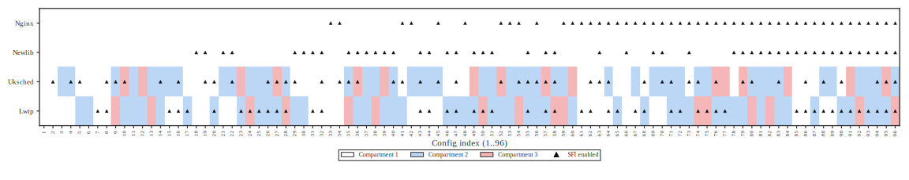
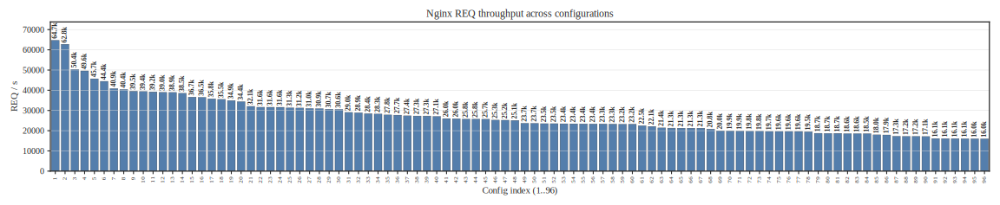
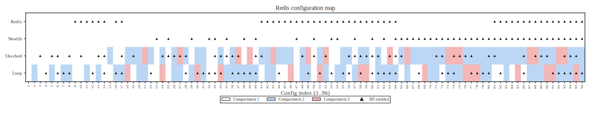
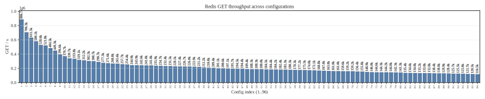
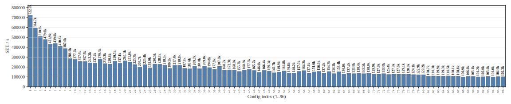
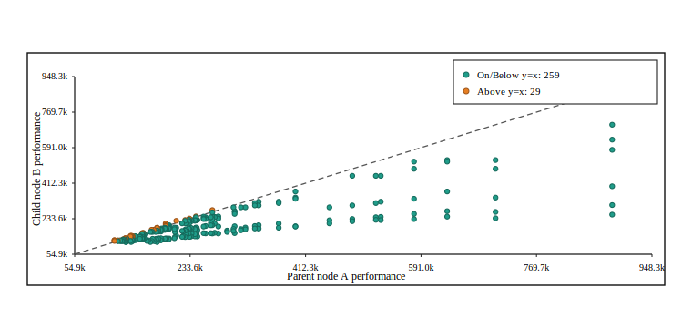
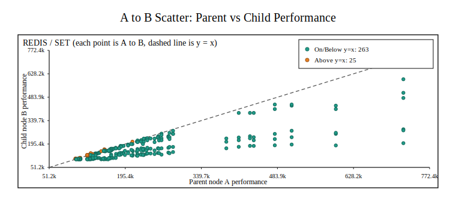

# AutoFlex：面向 FlexOS 的自动化迁移与安全配置搜索

> 说明：本文档为 Markdown 版本毕业论文正文草稿，章节结构与写作风格参考常见学位论文体例（摘要/关键词/章节编号等）。
>
> 文中图表与数据来自本文的实验评测产物；正文表述不依赖读者访问工程目录结构。

---

## 摘 要

随着云计算、物联网与边缘计算的快速发展，系统软件在“高性能”与“高安全”之间的矛盾日益突出。一方面，细粒度隔离能够显著降低漏洞被利用后的影响范围；另一方面，传统隔离手段（如进程/虚拟机）往往带来不可忽视的上下文切换与数据拷贝开销，难以在高性能网络服务与单地址空间库操作系统等场景中落地。FlexOS 提出可组合的隔离机制[1,2]，允许开发者按组件粒度选择不同隔离后端，并通过统一的 gate 抽象屏蔽后端差异，从而为“安全—性能”联合优化打开空间。然而，在实际工程中，FlexOS 的推广仍面临两类门槛：其一，遗留 C 代码向 gate 调用范式迁移成本高、易遗漏且难以规模化；其二，隔离配置维度多、组合爆炸导致配置空间指数增长，开发者难以在性能阈值约束下快速找到隔离强度最优的可行配置。

针对上述问题，本文围绕“自动化迁移”和“配置搜索”两个方向开展研究，提出并实现了面向 FlexOS 的自动化工具链 AutoFlex。第一，本文设计了规则驱动的迁移流水线：通过符号解析构建函数—库映射（基于 cscope 的符号关系提取）[14]，基于 Coccinelle 进行模式替换[10]，并以语句级后处理补齐复杂语法形态，从而将典型的 POSIX/库函数调用自动改写为 flexos_gate/flexos_gate_r 调用；同时在迁移后引入“未 gate 化外部调用（ungated-call）”覆盖检查，并可选集成通用静态扫描器（如 Semgrep、Cppcheck、Flawfinder）以进行快速安全审阅[11–13]。第二，本文将隔离配置空间建模为 DAG 偏序图，在单调性假设下利用祖先/后代闭包实现批量剪枝，并提出期望剪枝最大化的 balanced 搜索策略，通过在线估计可行概率自适应选择查询点，从而降低查询成本并提升触达最优前沿的效率。

实验结果表明：在 nginx[15]、redis[16]、lwip、newlib、iperf[17] 五个项目的迁移评估中，AutoFlex 的迁移对齐指标为“应改写外部调用 81 个、成功对齐 81 个、未解析 0 个”，并将人工修改行数降低 30.91%–100%；在安全配置搜索评估中，balanced 策略在多个数据集上显著降低平均查询比例，相比穷举（|V|=96）可减少约 63%–84% 的查询开销，并在部分数据集上更早触达最优前沿配置。

**关键词**：FlexOS；可组合隔离；gate 机制；自动化迁移；偏序图；配置搜索；静态检查

---

## ABSTRACT

Modern system software faces an increasingly sharp tension between performance and security. Fine-grained isolation can effectively confine the impact of vulnerabilities, yet traditional isolation mechanisms such as processes or virtual machines often introduce significant overheads (context switches, copies), making them less attractive for high-performance network services and single-address-space library OS scenarios. FlexOS advocates *composable isolation*: developers can select isolation backends per component and rely on a uniform *gate* abstraction to hide backend differences, enabling a principled security–performance trade-off. However, deploying FlexOS in practice still encounters two barriers: (1) porting legacy C code to the gate calling convention is costly, error-prone, and hard to scale; (2) the configuration space grows exponentially with multiple isolation dimensions, making it difficult to locate the strongest feasible isolation configuration under performance constraints.

This thesis presents **AutoFlex**, an automated toolchain for FlexOS that addresses both barriers. First, AutoFlex provides a rule-driven migration pipeline: it infers function-to-library mappings via symbol analysis, applies pattern-based transformations using Coccinelle, and performs statement-level post-processing to cover complex syntactic forms, automatically rewriting typical POSIX/library calls into flexos_gate/flexos_gate_r. It further introduces a post-migration *ungated-call* coverage check and optionally integrates off-the-shelf static scanners for lightweight security review. Second, AutoFlex models the isolation configuration space as a DAG partially ordered set (poset). Under a monotonicity hypothesis, it leverages ancestor/descendant closures for bulk pruning and proposes a balanced strategy that maximizes expected pruning with an online estimate of feasibility probability, reducing query cost and improving time-to-frontier.

Our evaluation shows that AutoFlex achieves an alignment of 81 expected calls, 81 matched calls, and 0 unresolved calls on five real-world projects (nginx, redis, lwip, newlib, iperf), while reducing manual changed lines by 30.91%–100%. For configuration search, the balanced strategy substantially lowers the average query ratio on multiple datasets; compared with exhaustive search (|V|=96), it reduces queries by roughly 63%–84% and, on some datasets, reaches the optimal frontier earlier.

**Key words**: FlexOS; composable isolation; gate; automated porting; poset; configuration search; static checking

---

## 目 录（简）

1. 绪论
2. 代码自动化移植与漏洞检测
3. 安全配置搜索算法
4. 实验与系统展示
5. 结论与展望

---

## 1. 绪论

### 1.1 课题研究背景及意义

系统软件长期面临“安全”与“性能”的权衡。一方面，操作系统与运行时承担着资源管理、设备访问、网络协议栈等关键功能，一旦暴露漏洞，攻击者可能借此窃取敏感数据、提升权限或破坏服务可用性；另一方面，服务端应用（如 Web 服务器、缓存系统）以及面向边缘/IoT 的轻量化系统又强依赖低延迟与高吞吐。

在实践中，开发者通常依赖以下两类思路应对风险：

一类是粗粒度的强隔离：将不同功能放入独立进程、容器或虚拟机。这类方法能显著降低攻击面，但隔离边界较粗、开销较大，且在需要细粒度组件复用或频繁交互时往往不可接受。另一类是单地址空间的高性能方案：在库操作系统或 unikernel 架构中将组件编译为单一地址空间，以降低系统调用与上下文切换开销，但这会使内存破坏类漏洞的影响范围扩大，单点故障更难隔离。

典型应用场景中，这种矛盾表现得尤为突出。

例如在云服务场景中，以 Nginx 为例[15]，其既服务公开静态资源，也可能参与处理含隐私的业务数据；若采用过强隔离（例如为每个组件单独虚拟机），吞吐与时延将显著下降；若不隔离，一处漏洞即可导致跨组件的数据泄露。在嵌入式与 IoT 场景中，智能设备常将网络栈与控制逻辑放在同一地址空间中运行，一旦网络栈被攻破，攻击者可能直接控制关键执行逻辑；虽然 TrustZone 等 TEE 提供隔离，但配置与开发流程复杂，难以在通用 C 生态中广泛采用。在微服务与 Serverless 场景中，函数或服务间共享底层内核或运行时，隔离策略与参数繁多且高度依赖经验，开发者往往在“默认配置”与“极端强隔离”之间摇摆，难以得到可解释的最优折中。

为缓解上述问题，FlexOS 提出**可组合隔离**思想[1,2]：按组件粒度选择隔离后端，并通过统一 gate 抽象实现跨域调用，从而在同一系统中允许不同组件采用不同隔离强度。该思想为“按需隔离”提供了工程可行性，但其落地仍受到两大门槛制约：

1. **代码迁移成本高**：存量 C 应用通常采用 POSIX/库函数直接调用范式，迁移到 gate 调用需要大量模式化改写与语义对齐，手工操作耗时且易漏改。
2. **配置空间过大**：隔离后端、组件划分、权限位、资源大小等多维参数组合导致指数级配置空间，开发者难以在性能约束下有效搜索最强隔离配置。

因此，研究面向 FlexOS 的自动化迁移与配置搜索方法，具有明确的现实意义：它不仅能降低研究者与工程团队验证 FlexOS 的成本，也可为其他强调可组合与细粒度隔离的系统提供可迁移的方法论。

### 1.2 FlexOS 及相关系统分析

传统隔离机制与局限可概括如下。

传统隔离机制在安全性与可用性方面各有优势，但难以同时满足“细粒度”和“低开销”。

进程级隔离具备成熟的权限模型与故障隔离能力，但在高频交互时受制于上下文切换、页表切换与拷贝成本。容器与命名空间在资源隔离上更轻量，但共享内核导致隔离不彻底，内核漏洞可能造成逃逸。硬件辅助隔离（如 VT-x/AMD-V、MPK 等）能够提供更强边界，但配置往往较为固化，难以为多组件提供可组合的差异化策略[7,8,19]。

其共同问题在于：开发者难以针对组件的重要性与攻击面差异进行“按需隔离”，最终经常采取“一刀切”策略。

与之对应的可定制化系统虽然推进了能力边界，但仍存在明显不足。

学术与工业界提出了多种可定制系统以追求更高性能或更强安全，但它们往往在语言生态、隔离粒度或工程复杂度上存在限制。

微内核通过 IPC 进行组件隔离，理论上可提供较强边界，但 IPC 开销与驱动生态使其在通用场景落地面临挑战；例如 seL4 的形式化验证工作展示了微内核强安全边界的可行性[20]。库操作系统与 unikernel 强调“应用与内核融合”以获得极致性能，但其单地址空间特性使内存安全与故障隔离成为核心短板[4,6,21,22]。语言安全型系统（如以 Rust 为核心的单地址空间设计）能够通过类型系统降低内存破坏风险，但对大量遗留 C 代码的迁移成本较高。

与本文最直接相关的是“库 OS/unikernel + 组件化隔离 + 自动化探索”这一交叉方向的最新研究：FlexOS 在 HotOS'21 工作中已经给出“隔离可组合”的动机与初步设计[5]，并在 ASPLOS'22 工作中系统化提出 gate 抽象与可组合后端，并配套提供可复现 artifact 与配置探索方法[1,2]；CubicleOS 则从库 OS 角度探索了软件组件化与实用隔离路径[6]；Wayfinder 进一步展示了在 OS 配置空间中用结构化搜索逼近最优解的可行性[3]。这些工作共同指向一个现实结论：当机制层面的可组合隔离已具备工程可用性之后，研究焦点将不可避免地转向“如何规模化迁移”与“如何在巨大配置空间中高效找到可解释的最优折中”，这正是 AutoFlex 的研究出发点。

在这一背景下，FlexOS 的设计与 gate 机制提供了新的折中路径。

FlexOS 基于 Unikraft 微库[1,4]，将系统划分为多个组件（或安全域/保护域），并允许针对不同组件选择不同隔离后端（例如进程、UKL、SFI、MPK 等）[7–9]。为屏蔽后端差异，FlexOS 提供统一的跨域调用抽象——**gate**[1]。

从已有系统经验看，SFI 也常被用于构建“在同一地址空间内的受限执行”沙箱，例如 Native Client 在浏览器/插件场景中展示了 SFI 沙箱的工程可行性[23]。

从开发者视角，gate 的关键价值在于：跨域调用在语义上被统一为显式的 gate 调用形式（如 flexos_gate(...) 与 flexos_gate_r(...)），后端实现细节对上层透明，从而支持“同一应用内多种隔离策略共存”。

然而，gate 机制也使得存量代码迁移面临大量模式化改写工作：函数调用点需要替换为 gate 调用，调用所在库（gate 目标）需要正确解析与映射，且不同语法形态（条件表达式、返回语句、强制类型转换等）对自动化改写提出更高要求。

### 1.3 本文主要研究内容

围绕 FlexOS 工程落地的关键门槛，本文主要开展以下两方面工作：

1. **面向 FlexOS gate 的自动化代码迁移与轻量安全检查**：设计并实现一套规则驱动迁移流水线，在保持改动可解释与可回溯的前提下，将常见 POSIX/库函数调用自动改写为 gate 调用；在迁移后提供 ungated-call 覆盖检查，并可选集成通用静态扫描器以辅助安全审阅。
2. **基于偏序关系的安全配置搜索算法**：将隔离配置空间建模为 DAG 偏序图，在单调性假设下利用祖先/后代闭包进行批量剪枝，并提出期望剪枝最大化的 balanced 搜索策略，降低查询比例并提升首次命中最优前沿的效率。

此外，本文在工具链层面统一了实验评估与绘图入口，便于他人复现与扩展。

### 1.4 论文章节安排

本文共分为五章，组织如下：

第一章介绍课题背景与研究意义，分析 FlexOS 及相关系统的特点与现存问题，并概述本文研究内容与结构安排。第二章面向 FlexOS gate 机制，阐述遗留 C 代码迁移的主要痛点，给出规则驱动迁移流水线的设计与实现，并介绍迁移后的轻量安全检查方法。第三章提出安全配置搜索的偏序建模方法，对问题进行形式化描述，在单调性假设下推导 balanced 策略及其实现细节，并讨论算法复杂度与适用边界。第四章给出实验设置与评估指标，分别评估自动化迁移与配置搜索的效果，并对单调性假设的违反情况进行统计分析；最后对系统化自动化平台展示进行说明。第五章总结本文主要贡献，分析当前局限，并展望未来工作方向。

---

## 2. 代码自动化移植与漏洞检测

### 2.1 FlexOS 的 gate 机制与迁移痛点

在 FlexOS 中，跨安全域交互被统一约束为 gate 调用，这意味着迁移工作本质上不是“机械替换函数名”，而是把原本隐式的跨域语义显式化。迁移后每个调用点都必须同时满足三件事：库域归属正确、参数与返回值通道一致、控制流与错误处理语义不漂移。以本文工具链的口径看，常见调用最终会归入 flexos_gate(lib, ret, func, ...) 或 flexos_gate_r(lib, retptr, func, ...) 两类形式；这两类形式虽然统一了接口外观，但也把很多原来在代码中被“默认假设”的细节暴露出来，例如返回值类型是否匹配、失败路径是否仍被正确传播、宏或条件表达式中的调用是否保持原求值顺序。

因此，第二章聚焦的问题可以概括为：如何在大规模 C 代码中完成可审阅、可回溯、可度量的 gate 化迁移。最棘手的点并不单一，而是多个约束叠加：一方面，同名函数可能出现在不同库中，若库域解析错误就会把调用送到错误隔离边界；另一方面，调用形态并不总是“独立语句”，大量调用嵌在 if、return、类型转换与宏展开中，简单模式匹配极易漏改或误改；再者，很多遗留代码依赖隐式错误处理约定，迁移后若只改了表层调用而没有补齐返回值接收与检查，就会引入新的语义缺陷；最后，仅通过“能编译”无法说明迁移正确，必须配套覆盖统计与可定位报告，把风险收敛到可人工复核的候选点集合。

从形式化角度，设原始文件为 $S$，候选外部调用点集合为 $\mathcal{C}(S)=\{c_1,\dots,c_m\}$，迁移器目标可写为重写算子 $T$：

$$
T(S) = S' 
$$

要求是：若 $c_i$ 的目标函数属于需隔离库域，则在 $S'$ 中存在对应 gate 调用 $g_i$，并满足：

$$
		\text{callee}(g_i)=\text{callee}(c_i),\quad \text{lib}(g_i)=\pi(\text{callee}(c_i)),\quad \text{args}(g_i)=\text{args}(c_i)
		\tag{2-1}
$$

式(2-1)强调迁移的核心不是“识别到调用”本身，而是对库域映射函数 $\pi$ 的可靠求解与参数约定保持。AutoFlex 的设计因此优先保证四件事：每次改写都有来源证据、每次运行都能输出可审阅产物、覆盖效果可被量化、规则体系能持续扩展到新库与新模式。

### 2.2 自动化迁移流水线设计

本文提出并实现的迁移流水线遵循“先高覆盖、后高精度”的分层思路：先做函数到库域的稳定映射，再用 Coccinelle 完成第一轮大规模模式替换[10]，最后用语句级后处理收敛复杂语法场景。这样做的目的不是把迁移包装成黑盒，而是让每一层都有可检查的中间产物，最终把人工工作从“全量通读源码”压缩为“围绕差异与报告做重点复核”。

（待补图，设计占位）

> 图2-1（待补）AutoFlex 迁移流水线总览（输入工程→符号解析→规则/补丁生成→批量替换→语句级后处理→覆盖检查/评测归档）

建议该图以“阶段盒图 + 关键中间产物”为主：输入为源码树与目标文件；输出包括调用映射表、语义补丁集合、迁移差异补丁、覆盖扫描报告以及汇总统计结果，并明确标注“人工审阅/校正”发生在报告驱动的少量候选点上。

读图说明：按从左到右的顺序阅读各阶段盒图。上半部分给出数据流（输入源码与目标文件，经过符号解析与规则生成，产生批量替换与语句级后处理的改写结果）；下半部分给出证据链产物（映射表、补丁、覆盖扫描报告与汇总统计），并标注哪些产物直接面向人工审阅。

结论式解读：该图强调 AutoFlex 的目标不是把迁移变成不可解释的黑盒，而是把迁移拆成可检查的阶段性结果，使人工工作从“全量通读源码”收敛为“围绕报告与差异产物做重点复核”，从而降低迁移成本并提高可复核性。

#### 2.2.1 函数到库域映射

从产物角度看，流水线每次运行会稳定产出调用映射表、语义补丁、迁移差异与覆盖扫描报告。调用映射表由 cscope 解析与规则回退共同生成[14]，其职责是把“函数调用属于哪个库域”这一关键决策显式化；语义补丁承担第一轮批量改写；差异与覆盖报告用于把人工复核范围控制在少量候选点。该机制的重点是可追溯：当某个改写结果不符合预期时，可以回到映射来源、规则文本与具体差异逐层定位问题，而不是在最终代码上盲目排查。

为了说明映射阶段的决策逻辑，下面给出函数到库域映射的伪代码。它体现了“唯一定义优先，显式回退兜底”的策略：

$$
\begin{aligned}
&\textbf{Algorithm 2-1: Function-to-Library Mapping (}\pi\textbf{)}\\
&\text{Input: source tree } \mathcal{T},\ \text{target file } S\\
&\text{Output: mapping } \pi: \text{Func} \to \text{Lib} \\
&\text{Init: } \pi \leftarrow \emptyset,\ \mathcal{F} \leftarrow \text{ExternalSymbols}(S)\\
&\text{Build cscope DB over } \mathcal{T}\\
&\text{For each } f \in \mathcal{F}:\\
&\quad D_f \leftarrow \text{DefSites}(f) \ \ \text{(via cscope lookup)}\\
&\quad \text{If } |D_f| = 1:\\
&\qquad lib \leftarrow \text{InferLibFromPath}(D_f[0])\\
&\qquad \pi[f] \leftarrow lib\\
&\quad \text{Else:}\\
&\qquad \text{If } f \in \pi_{fallback}:\ \pi[f] \leftarrow \pi_{fallback}[f]\\
&\qquad \text{Else: mark } f \text{ as unresolved}\\
&\text{Return } \pi
\end{aligned}
$$

其中 InferLibFromPath 的工程化做法是从符号定义路径提取 lib/{name}/ 或 libs/{name}/ 并归一化为 gate 库名；若某函数定义不唯一，系统倾向保守处理，优先使用显式回退映射或交由人工补充，避免把调用误送到错误库域。与此同时，流水线还会做关键字过滤、接口别名归一化和返回值类型辅助推断，减少误报、假阴性与类型不匹配带来的二次人工修补。

#### 2.2.2 Coccinelle 结构化批量替换

在映射确定后，AutoFlex 进入 Coccinelle 批量替换阶段。选择 Coccinelle 的原因是它基于 SmPL 做结构化匹配[10,26]，相比纯文本替换更能约束作用域与语法位置，从而在大规模代码上实现“可控覆盖”。这一阶段优先覆盖最常见的独立语句调用形态，即赋值调用与纯调用，其目标是先稳定吃掉高占比、低风险改写点，为后续高难场景留出更小的处理面。

仅仅说“结构化匹配”还不够解释其价值。Coccinelle 的实际工作方式是：先把 C 源码解析为可匹配的语法结构，再由 SmPL 中的元变量（如 expression list EL、expression var）建立约束，最后在满足约束的位置生成变换。换言之，它不是对字符串做替换，而是在“调用表达式、赋值语句、参数列表”这些语法层对象上做匹配，因此能显著减少注释、字符串字面量、同名标识符等导致的误替换。与此同时，SmPL 规则本身是文本可读的，天然具备审阅友好性：每次规则修改都能通过差异审查解释“为什么改、改了哪里、作用域是什么”。

从工程实践看，Coccinelle 在本文场景中有效，主要因为它解决了“高频、同构、跨文件”的第一波改写任务。遗留代码中大量调用具有稳定句型，若全部手工改写，成本高且易出现一致性错误；而 Coccinelle 可以把这类高重复度改写收敛为少量可复用规则。更重要的是，规则执行结果可直接形成差异输出，与后续覆盖检查和人工复核形成闭环，避免“自动改完但不可解释”的黑盒风险。

替换目标为统一的 gate 调用形式。例如，以 func 属于库 libX 为例，迁移后得到：

```c
// 原始代码（示意）
ret = func(a, b);

// 迁移后（示意）
flexos_gate(libX, ret, func, a, b);
```

在 AutoFlex 的语义补丁生成中，这两类模式分别对应一组 SmPL 规则族（伪示例如下）：

```c
// 伪 SmPL（示意）：有返回值的调用
@r@
expression list EL;
expression ret, var;
@@
原：var = func(EL);
改：flexos_gate(libX, var, func, EL);

// 伪 SmPL（示意）：无返回值的调用
@nr@
expression list EL;
@@
原：func(EL);
改：flexos_gate(libX, func, EL);
```

#### 2.2.3 语句级后处理与受限提升

这一层的价值在于，它以较低风险覆盖了最主要的模式化改写需求；但对于 if 条件、return 表达式、强制类型转换、宏嵌套与函数指针等复杂语法，系统不在这一层强行“全自动吃掉”，而是转入语句级后处理。后处理的核心思路是把内嵌调用提升为独立语句，再用临时变量承接返回值，尽量保持原控制流语义。例如：

```c
// 原始代码（示意）
if (func(a) == 0) {
    ...
}

// 改写后（示意）
ret = 0;
flexos_gate(libX, ret, func, a);
if (ret == 0) {
    ...
}
```

在实现上，这一阶段由 Python 脚本执行行级匹配与重写，并与前两层共享同一映射语义。其可抽象为“受限语句提升（statement hoisting）”规则族：

$$
		\texttt{if (f(args) \;op\; k) \{...\}}\ \Rightarrow\ \texttt{tmp = 0; gate(f,args, tmp); if (tmp \;op\; k) \{...\}}
		\tag{2-2}
$$

$$
		\texttt{if ((x = f(args)) \;op\; k) \{...\}}\ \Rightarrow\ \texttt{gate(f,args, x); if (x \;op\; k) \{...\}}
		\tag{2-3}
$$

$$
		\texttt{return f(args);}\ \Rightarrow\ \texttt{gate(f,args, tmp); return tmp;}
		\tag{2-4}
$$

$$
		\texttt{x = (T)f(args);}\ \Rightarrow\ \texttt{gate(f,args, tmp); x = (T)tmp;}
		\tag{2-5}
$$

这些变换看似直接，实际落地时仍需同时控制求值顺序、副作用传播与临时变量类型一致性。AutoFlex 的处理原则是“能稳则改，复杂则保守”：对单行可稳定识别模式自动提升，对多行宏与复杂表达式保守跳过并留给人工复核。这样做牺牲了少量自动化覆盖，但显著降低了语义误改风险。

### 2.3 迁移引入漏洞的 gate 完整性校验（GCC 插桩 + 运行时）

自动迁移完成后，最关键的问题不是“代码里看起来是否都替换了 gate”，而是“运行时是否仍存在绕过 gate 的跨域调用”。为此，本文将 gate 完整性检测主线设置为 GCC 函数插桩与运行时校验：在目标库启用函数级插桩后，每次函数进入与退出都会触发库内 hook 写入局部 guard 变量；若某条跨域路径缺失 gate，在 MPK 等域内隔离后端下更容易在运行中暴露为异常行为或崩溃，从而把潜在漏改从静态可疑点提升为可观测故障信号。

这里的关键机理在于 GCC 选项 -finstrument-functions 的编译时插入行为。开启后，编译器会在每个函数入口自动插入对 __cyg_profile_func_enter 的调用，在每个函数返回路径插入对 __cyg_profile_func_exit 的调用；因此即便业务代码本身没有显式写这两个函数，运行时也会在所有被插桩函数上触发它们。若再结合库内的 volatile guard 写操作，hook 的每次执行都会产生真实内存访问，不会被优化器轻易消去。为防止 hook 自身再次被插桩导致递归，工程上必须同时使用 no_instrument_function 属性或在排除列表中显式排除 __cyg_profile_func_enter/__cyg_profile_func_exit。

从隔离语义看，这套机制有效的原因是它把“漏 gate”转化为“域内访问异常”的可观测事件。若调用通过正确 gate 进入目标库，域切换或权限切换已发生，hook 对库内 guard 的读写应当可达；若调用绕过 gate 直接进入目标库函数，在 MPK 等机制下通常缺少对应权限上下文，hook 的 guard 写入更容易触发保护异常。也就是说，插桩并不直接“证明正确”，而是把原本可能静默存在的缺 gate 错误转化为 fail-stop 信号，显著提升了问题暴露概率与定位效率。

可将编译器插入逻辑抽象为以下形式：

```c
// 对任意被插桩函数 f()，编译后近似为：
void f(...) {
	__cyg_profile_func_enter(this_fn, call_site);
	/* original body */
	__cyg_profile_func_exit(this_fn, call_site);
}
```

该流程与 FlexOS 原始工程文档中的建议一致。实现上，迁移流水线在 gate 改写后追加三步：首先向目标库编译参数注入函数插桩开关并排除 hook 本身；其次生成包含 guard 变量与两个 hook 函数的辅助源文件并纳入构建；最后执行构建与运行，依据运行日志中的异常模式给出通过、失败或待复验结论。该结论与传统代码差异统计相互独立，专门用于回答“隔离边界是否在运行态保持完整”。

（待补图，设计占位）

> 图2-2（待补）gate 完整性运行时校验示意（迁移后代码→插桩注入→构建运行→崩溃/通过判定）

建议该图突出两条路径：一条是 gate 完整时的正常执行路径，另一条是缺失 gate 时在隔离后端下触发异常的路径；并标注判定产物为 instrumentation 报告、构建日志与运行结论文件。

读图说明：图中应先展示插桩如何绑定到目标库函数，再展示运行阶段如何把“是否崩溃、是否出现保护异常”转化为可复核结论。相比仅凭文本扫描命中，运行时路径直接观测到隔离语义是否被破坏，因此更适合作为 gate 完整性的主证据。

结论式解读：该机制把检测目标从“可疑代码形态”前移到“运行态边界是否破裂”。即便静态替换统计看似充分，只要运行态出现与缺 gate 一致的异常模式，系统就会将其判定为高优先级风险并要求人工回查。

在这一框架下，风险模型可以被简单地概括为：缺 gate 会导致边界绕过与策略不一致，而这两类风险本质都发生在执行路径中，因此必须以运行态证据为主，而不是仅靠文本级命中。设迁移后程序为 $S'$，目标库集合为 $\mathcal{L}$，流程由插桩注入和运行判定两步构成：前者在编译选项中开启函数级插桩并排除 hook 自身，同时在库内写入 guard；后者在隔离后端执行镜像并用退出状态与日志模式给出结论。其判定集合记为：

$$
verdict(S') in {pass, fail, inconclusive}
(2-6)
$$

其中 pass 表示未观测到与缺 gate 一致的运行态异常，fail 表示出现崩溃或保护异常信号，inconclusive 表示因超时、环境条件不足或依赖缺失而无法完成有效判定。这个三值结论用于工程分流：fail 直接进入高优先级回查，inconclusive 进入待复验队列。

需要特别区分的是，expected、matched、unresolved 这组迁移一致性指标仍然有价值，但它们回答的是“自动结果与人工参考答案是否对齐”，并不直接回答“运行态边界是否完整”。因此本文把这组指标视为迁移质量信号，把插桩运行判定视为安全主信号；同时保留 cppcheck、semgrep、flawfinder 等静态扫描器[11–13]作为辅助提醒，用于捕捉一般性缺陷线索，但不把它们当作边界完备性证明。

---

## 3. 安全配置搜索算法

### 3.1 配置空间的偏序建模

FlexOS 的可组合隔离机制允许开发者在“组件/库”的粒度上选择不同隔离强度（例如是否启用 SFI、组件是否被放入独立隔离域等）[1]。这使得系统整体呈现为一个高维配置向量空间。类似的“巨大配置空间 + 成本高昂的性能测量”问题也出现在 Wayfinder 等自动化配置探索工作中[3]。为了在搜索中系统地利用“隔离强弱”的结构信息，本文将配置空间建模为偏序集合（poset），并以其 cover 图（有向无环图，DAG）表达覆盖关系。

先给出配置向量的离散化表示（实验数据口径）。

在本文使用的离线配置—参数映射数据中，每个配置可表示为两个向量：

$$
v = (\mathbf{c}_v,\ \mathbf{s}_v)
	\tag{3-0}
$$

其中：

$\mathbf{c}_v: \mathcal{L}\to \mathbb{N}$ 为“组件隔离域布局”向量，$\mathcal{L}$ 为库集合（例如 nginx/newlib/lwip/uksched 等）；$\mathbf{c}_v[\ell]$ 的数值越大，表示该库在布局上被划分到更细粒度的隔离结构（在数据集中体现为离散等级）。同时，$\mathbf{s}_v: \mathcal{L}\to \{0,1\}$ 为 SFI 开关向量，$\mathbf{s}_v[\ell]=1$ 表示该库启用额外的 SFI 硬化。

该表示的优点是：它将“隔离强弱”直接落到每个维度的离散等级上，从而可用简单的分量比较构造偏序。

在向量表示基础上，可进一步定义偏序关系与 cover 关系（cover 图/DAG）。

设配置集合为 $V$，定义偏序关系 $\preceq$ 为分量不减的产品序：

$$
u \preceq v \iff \forall \ell\in\mathcal{L},\ \mathbf{c}_u[\ell] \le \mathbf{c}_v[\ell]\ \wedge\ \mathbf{s}_u[\ell] \le \mathbf{s}_v[\ell]
	\tag{3-1}
$$

直观上，$u\preceq v$ 表示 $v$ 在所有库维度上都“不弱于” $u$，因此 $v$ 的隔离强度至少与 $u$ 一样强。进一步定义严格偏序 $u\prec v$ 为 $u\preceq v$ 且 $u\ne v$。

在该偏序下，cover 关系（cover relation）定义为：$u$ 被 $v$ 覆盖，当且仅当 $u\prec v$ 且不存在中间点 $w$ 满足 $u\prec w\prec v$。因此 cover 图的边集为：

$$
E = \{(u, v) \mid u \prec v \ \wedge\ \nexists\ w,\ u \prec w \prec v\}
	\tag{3-2}
$$

为直观展示“配置节点 + cover 边”所构成的偏序结构，图3-1 给出一个配置空间偏序结构的可视化示例（cover 图/DAG）：


> 图3-1 配置空间偏序图示例（DAG/poset）

读图说明如下。

第一，每个节点对应一个离散隔离配置。图中从上到下可理解为隔离强度逐步增强的层级分布；节点采用灰度深浅编码隔离强弱，灰度越深表示约束越强。

第二，每条有向边表示 cover 关系：若存在边 u→v，则 v 在偏序意义下严格强于 u，且二者之间不存在中间配置点。因而，沿边从上到下移动，可理解为“在不跨越中间等级的前提下，把隔离强度增加一步”。

第三，这张图的核心用途并不是展示某个具体节点的性能数值，而是为后续算法提供结构直觉：在该 DAG 上预处理祖先闭包与后代闭包后，一次查询即可在候选集中批量删除一组节点，从而显著减少需要实际测量的配置点数。

由于 $\preceq$ 为偏序，cover 图必为 DAG。该 DAG 的祖先/后代闭包为剪枝提供基础；在实现中，对每个节点预处理祖先闭包与后代闭包的位集表示，以支撑 $|anc(\cdot)\cap C|$、$|desc(\cdot)\cap C|$ 的高效计数。

在本文实验数据中，每个数据集的配置空间规模为 $|V|=96$，其 cover 图边数为 288（见第四章单调性统计）。

### 3.2 问题形式化与单调性假设

对任一配置 $v$，定义其性能度量为 $g(v)$（例如 nginx 的吞吐量 REQ，或 redis 的 GET/SET 指标）。在真实系统中，$g(v)$ 需要通过“构建镜像 + 运行基准 + 统计”获得，因而一次查询代价高；在本文实验中，$g(v)$ 来自离线测得的配置—性能数据，并按配置对重复测量取聚合统计量（例如均值），搜索算法把读取某配置的统计量视作一次“昂贵查询”的代理。

给定性能阈值 $\theta$，定义可行集合：

$$
F = \{ v \in V \mid g(v) \ge \theta \}
	\tag{3-3}
$$

本文关注的目标是：在尽可能少的查询次数下，找到“隔离强度尽可能强”的可行配置集合，即可行集合在偏序下的极大元（maximal elements）所构成的前沿 $F^*$：

$$
F^* = \{v\in F\mid \nexists\ u\in F,\ v\prec u\}
	\tag{3-4}
$$

该定义对应常见的 Pareto 最优前沿：前沿上的任一点都不可被另一“更强隔离且仍可行”的点支配。

为了实现批量剪枝，搜索过程引入以下单调性假设：

> **单调性假设（Hypothesis）**：若 $u \preceq v$（$v$ 隔离不弱于 $u$），则 $g(v) \le g(u)$。

该假设表达了直觉：隔离越强，性能开销越大，因此性能不应上升。若假设成立，则：

当某点 $c$ 不可行（$g(c)<\theta$）时，其所有后代（更强隔离）也不可行，因此可一次性剪去 $desc(c)$；当某点 $c$ 可行（$g(c)\ge\theta$）时，其祖先（更弱隔离）都可行，但它们不可能成为“最强可行前沿”的成员，因此可一次性从候选集中移除 $anc(c)$。

需要注意的是，实际系统中缓存效应、资源争用、测量噪声等因素可能导致单调性被违反。本文在第四章中对违反情况进行统计并讨论其影响。

在单调性成立的条件下，剪枝正确性可由以下引理与定理支持。

在单调性假设成立时，阈值可行集合具有“向下闭包”性质，这是剪枝可行的根本原因。

**引理 3-1（可行集向下闭包）**：若单调性成立，则 $F$ 对 $\preceq$ 向下闭合，即 $v\in F$ 且 $u\preceq v$ 时必有 $u\in F$。

*证明*：由 $u\preceq v$ 与单调性得 $g(u)\ge g(v)$。又 $v\in F$ 意味着 $g(v)\ge \theta$，于是 $g(u)\ge \theta$，从而 $u\in F$。证毕。

引理 3-1 的直接推论是：不可行集合 $V\setminus F$ 为向上闭合（upper set）。因此对任一点 $c$：

若 $c$ 不可行，则其所有后代都不可行，可安全移除 $desc(c)$；若 $c$ 可行，则其所有祖先都可行，但其中任何点都被 $c$（或其他更强可行点）支配，不可能属于 $F^*$，因此也可安全移除 $anc(c)$。

进一步地，还可证明“终止时一定查询到全部前沿点”。

**定理 3-1（前沿完备性）**：在单调性成立时，采用统一剪枝规则并持续迭代直至候选集为空，最终返回的 $\text{Maximal}(R)$ 等于真实前沿 $F^*$。

*证明（要点）*：设 $f\in F^*$ 为任一前沿点。考虑搜索过程中 $f$ 被移出候选集 $C$ 的可能方式：

1. 若某次因查询不可行点 $c$ 而移除 $desc(c)$，要使 $f$ 被移除则需 $c\preceq f$。但单调性下 $c$ 不可行推出其所有后代不可行，与 $f\in F$ 矛盾。
2. 若某次因查询可行点 $c$ 而移除 $anc(c)$，要使 $f$ 被移除则需 $f\preceq c$。这意味着存在比 $f$ 更强或相等的可行点 $c$，且当 $f\ne c$ 时有 $f\prec c$，与 $f$ 的极大性矛盾。

因此，$f$ 不会在未被查询的情况下被剪枝移除，必将作为候选点在某一轮被查询并加入 $R$。所以 $F^*\subseteq R$。另一方面，$R\subseteq F$（只记录可行点），且 $\text{Maximal}(R)$ 恰好去除被支配的非前沿点，故 $\text{Maximal}(R)=F^*$。证毕。

该定理说明：在假设成立时，选点策略只影响查询次数与“首次命中速度”，并不影响输出前沿的正确性。

对应的评估指标主要围绕查询成本与首次命中效率。

基于上述目标，本文采用两类指标刻画搜索效率：

第一类是查询次数：一次搜索过程中实际查询的配置点数量记为 $Q$，并归一化为查询比例 $q=Q/|V|$。第二类是首次命中步数：搜索轨迹中第一次查询到属于 $F^*$ 的步序号记为 $H$，并归一化为首次命中比例 $h=H/|V|$。

在对比中，对于穷举法（exhaustive）的首次命中步数，采用期望位置 $|V|/|F^*|$，用于把“完全扫描”的首次命中映射到与随机/策略搜索可比较的尺度。

### 3.3 期望剪枝搜索策略（balanced）

先给出基本剪枝框架。

对 DAG 中任一节点 $v$，记其祖先闭包与后代闭包分别为：

$$
anc(v) = \{u \in V \mid u \preceq v\}, \quad desc(v) = \{u \in V \mid v \preceq u\}
\tag{3-2}
$$

搜索过程中维护候选集 $C \subseteq V$。每轮从 $C$ 中选取一个点 $c$ 进行查询并应用剪枝：

若 $g(c)\ge\theta$（可行），则从 $C$ 中移除 $anc(c)$；否则（不可行），从 $C$ 中移除 $desc(c)$。

该规则与具体“选点策略”解耦：不同策略只决定每轮选取哪个 $c$，而剪枝逻辑保持一致。

（待补图，设计占位）

> 图3-2（待补）一次查询触发剪枝的示意（可行→删除祖先，不可行→删除后代）

建议该图给出一个小型 poset/DAG：用颜色区分当前候选集 $C$、被查询点 $c$、被删除的 $anc(c)$ 与 $desc(c)$，并在两条分支上标注阈值判定 $g(c)\ge\theta$ / $g(c)<\theta$，对应候选集按位清零更新式(3-5)。

读图说明：先看候选集 $C$ 中被选中的查询点 $c$，再沿着阈值判定分支阅读：当 $g(c)\ge\theta$ 时，剪去其祖先闭包；当 $g(c)<\theta$ 时，剪去其后代闭包。图中应显式标出被一次查询批量删除的区域，以凸显剪枝的规模效应。

结论式解读：该图用最小示例说明“为什么偏序结构能显著减少查询次数”：一次昂贵的性能测量不仅给出当前点的可行性，还能在单调性假设下推导一批点的可行性，从而把全量扫描的成本压缩为远少于 $|V|$ 次的查询。

从实现角度看，候选集 $C$ 以位掩码表示；每次剪枝相当于执行一次位清零：

$$
C \leftarrow C\ \&\ \neg anc(c)\ \ \text{或}\ \ C \leftarrow C\ \&\ \neg desc(c)
	\tag{3-5}
$$

这种表示使得“删除一批祖先/后代”可以近似视为 $O(|V|/w)$ 的位运算（$w$ 为机器字长），远小于真实系统中一次基准运行的代价。

在框架之上，引入期望剪枝量进行选点。

balanced 策略的核心是：将“每次查询能剪掉多少候选”显式作为优化目标，并引入可行概率估计。设当前候选集为 $C$，对候选点 $i$ 定义：

$$
 a_i = |anc(i) \cap C|,\quad d_i = |desc(i) \cap C|
\tag{3-3}
$$

其中 $a_i$ 与 $d_i$ 分别代表若查询 $i$ 且结果为可行/不可行时，理论上可被批量剪枝的规模。

设当前对“可行”的在线估计概率为 $p$，则期望剪枝量定义为：

$$
E_i = p\cdot a_i + (1-p)\cdot d_i
\tag{3-4}
$$

balanced 策略每轮选择 $E_i$ 最大的候选点进行查询。在实现中，为避免早期样本不足导致 $p$ 取值极端，引入平滑估计：

$$
 p = \frac{n_{feasible}+1}{n_{observed}+2}
\tag{3-5}
$$

这对应 Beta(1,1) 先验下的后验均值，使得搜索在早期更稳定。

需要指出的是，式(3-4) 直接对应“候选集规模的期望下降”：查询点 $i$ 后，候选集将以概率 $p$ 删除 $anc(i)$，以概率 $1-p$ 删除 $desc(i)$，而 $a_i,d_i$ 正是这两种情况下的删除规模。因此，balanced 本质上是在做一种**贪心的期望信息增益/期望剪枝最大化**。

此外，本文实现对并列情况引入了稳定的 tie-break：当多个点具有相同期望剪枝量时，优先选择 $|a_i-d_i|$ 更小的点（更“均衡”的二分），再按配置 ID 稳定打破并列。该设计的直觉是避免总是选取“极端偏向祖先或后代”的点，从而在不同阈值分布下提升鲁棒性。

完整算法可写为如下伪代码。

$$
\begin{aligned}
&\textbf{Algorithm 3-1: Balanced Search on Poset}\\
&\text{Input: } (V,E),\ g(\cdot),\ \theta\\
&\text{Output: } F^*\\
&\textbf{Precompute: } anc(\cdot),\ desc(\cdot)\\
&C \leftarrow V,\ R \leftarrow \emptyset,\ n\leftarrow 0,\ m\leftarrow 0\\
&\textbf{while } C \neq \emptyset:\\
&\quad p \leftarrow \frac{m+1}{n+2}\\
&\quad c \leftarrow \arg\max_{i\in C}\Big(p\cdot |anc(i)\cap C| + (1-p)\cdot |desc(i)\cap C|\Big)\\
&\quad n \leftarrow n+1\\
&\quad \textbf{if } g(c) \ge \theta:\\
&\qquad R \leftarrow R \cup \{c\},\ m \leftarrow m+1\\
&\qquad C \leftarrow C \setminus anc(c)\\
&\quad \textbf{else: } C \leftarrow C \setminus desc(c)\\
&F^* \leftarrow \text{Maximal}(R)\\
&\textbf{return } F^*
\end{aligned}
$$

在实现中，为加速闭包交集计数，祖先/后代集合以位集（bitset）形式预处理与存储。

### 3.4 复杂度分析

balanced 搜索的复杂度由“预处理 + 搜索”两部分构成。

1. **cover 图构造**：若从配置集合直接构造 cover 边（需要判断是否存在中间点），朴素实现为 $O(|V|^3)$。在本文实验设置下 $|V|=96$，该成本可接受；当配置规模增大时，应考虑更高效的传递约简算法或基于增量维护的构造方式。
2. **闭包预处理**：对每个节点计算 $anc(\cdot)$、$desc(\cdot)$ 的位集。以位集表示时，空间复杂度约为 $O(|V|^2/w)$ 个机器字（$w$ 为字长）；在 $|V|=96$ 下远小于一次实验产物的体量。
3. **搜索阶段**：每轮需要计算候选集中各点的 $a_i,d_i$（式(3-3)），核心操作是位集与运算 + popcount 计数。设位集长度为 $B=\lceil |V|/w \rceil$，则一次候选点评估代价约为 $O(B)$，一次选点扫描代价约为 $O(|C|\cdot B)$。若最坏情况下需要查询 $Q=|V|$ 轮，则总时间约为 $O(|V|^2\cdot B)$。

需要强调的是：在真实系统中，主要成本来自“运行基准得到 $g(c)$”的实验代价，而不是上述位运算。因此搜索算法的设计目标并非减少 CPU 指令数，而是**尽可能减少昂贵查询次数**。

查询次数方面：

在最坏情况下，单调性假设完全失效或剪枝无效时，算法可能退化为查询全部点，即 $O(|V|)$。在理想情况下，当 DAG 结构“可分裂”且估计的 $p$ 能引导有效剪枝时，查询次数将显著小于 $|V|$；第四章将以查询比例 $\text{query\_ratio}=\text{query\_count}/|V|$ 对该收益进行度量。

此外，在单调性严格成立时，剪枝规则保证“不会因策略不同而改变结果前沿”（定理 3-1），因此查询次数的下降可以直接解释为“用更少的测量成本得到相同的最优前沿”。当单调性被违反时，该解释不再无条件成立，需要结合第四章对违反比例与 gap 分布的统计来讨论其风险边界。

### 3.5 讨论：与 Wayfinder 的关系及鲁棒性边界

本节给出若干讨论性结论，用于把第三章的“结构化搜索”与第四章的“实证验证”连接起来：一方面说明 poset 剪枝与已有配置优化工作的互补性，另一方面明确单调性仅近似成立时，搜索策略在工程上应如何理解其风险与适用范围。

首先讨论结构化偏序剪枝与通用配置优化的互补关系。

Wayfinder 等工作展示了在 OS 配置空间中进行自动化探索与优化的可行性[3]。从问题形态上看，二者都面对两个核心困难：配置空间维度高、评测代价高昂；因此都需要“用更少的代价逼近最优折中”。不同之处在于，本文把 FlexOS 的隔离配置显式建模为偏序集合，并将其 cover 图作为剪枝依据：在单调性成立时，任何一次可行/不可行判断都可以成批删除祖先或后代，从而把一次测量的收益放大到一组候选点。与常见的黑盒配置优化（如 SMBO/贝叶斯优化）相比[24,25]，本文更强调利用机制语义导出的结构化剪枝来减少查询。

这种“把机制语义（隔离强弱）转化为搜索结构（偏序）”的做法，与很多通用的黑盒优化方法是正交的：黑盒方法通常依赖代理模型或启发式来决定下一个查询点，而本文的剪枝规则则直接来自偏序与阈值可行性的推理结果。换言之，本文的贡献更多体现在**利用结构把“搜索”从线性扫描变成可剪枝的集合推理**；而在该推理框架之上，仍可以引入更丰富的选点准则（例如在不同阈值分布、不同噪声强度下动态调节探索与利用的比例），以进一步改善“首次命中速度”或稳定性。

其次讨论单调性仅“近似成立”时如何从硬剪枝转向软假设。

第三章的正确性定理依赖“严格单调”。但在真实测量中，单调性更合理的理解是“统计意义上的近似单调”：隔离更强通常更慢，但受噪声与系统二阶效应影响，局部边上可能出现性能反转。第四章的违反统计提供了一个重要事实基础：违反并非零概率事件，因此不能把剪枝的正确性理解为无条件保证。

从工程角度，可以把单调性从“硬约束”放宽为“允许容忍度 ε 的软约束”，即允许 $g(v)$ 在小幅度上高于 $g(u)$ 而不视为违反。假设验证可同时报告 required_epsilon_absolute 与 required_epsilon_relative：前者对应绝对差值尺度，后者把差值归一化到源配置的性能尺度上，更便于在不同基准间比较。该视角的意义在于：它把“违反”从二元事件（违/不违）转化为可度量的幅度，从而为后续的保守剪枝、重复测量或阈值邻域加密采样提供了参数依据。

需要强调的是，放宽 ε 并不自动等价于“更安全”：ε 越大，越容易把真实的反转当作噪声吞掉；ε 越小，则更接近严格单调但更容易受噪声影响。因此 ε 的选取应与实验协议（重复次数、置信区间）和目标风险偏好共同决定，并在论文中明确报告，以保证结论可复核。

最后讨论可解释性与可复现性，即如何从“结果”回溯到“路径”。

在系统论文语境下，搜索算法的价值不仅在于“给出推荐配置”，还在于它能否提供可审阅的证据链。本文将搜索过程显式记录为路径与统计产物：一方面在聚合层输出跨阈值、跨随机种子的汇总统计，便于对不同方法进行均值/方差层面的比较；另一方面提供搜索路径可视化（如 nginx:REQ 的路径图），使得研究者可以把一次推荐追溯到“每一步查询了什么点、剪掉了哪些祖先/后代、为何最终前沿成立”。这种“路径可解释性”在单调性近似成立的场景尤为重要：当结果与直觉不一致时，路径与违反边列表可以帮助定位问题来自噪声、来自个别边的反转，还是来自阈值选择导致的边界效应。

---

## 4. 实验与系统展示

### 4.1 自动化迁移效果评估

本节给出自动化迁移的量化效果评估。评测以人工迁移结果作为对照答案（oracle），从两个维度回答两个问题：第一，自动化是否覆盖了人工版本中的关键 gate 调用；第二，自动化在多大程度上减少了仍需人工介入的修改量。

#### 4.1.1 覆盖率与对齐率

本文使用以下三个统计量评估 gate 迁移覆盖：

三项统计量分别为：目标 gate 调用数（人工迁移版本中出现的 gate 调用总数，作为期望覆盖的目标数量）、命中 gate 调用数（自动迁移结果中与人工版本对齐命中的 gate 调用总数）以及未对齐 gate 调用数（目标中未被命中的 gate 调用总数）。

在本次评测的总体汇总中：目标 gate 调用数为 81，命中 gate 调用数为 81，未对齐 gate 调用数为 0。

进一步按应用统计如下：

| 应用 | 文件数（含改动） | 目标 gate 调用数 | 命中 gate 调用数 | 未对齐 gate 调用数 |
|---|---:|---:|---:|---:|
| nginx | 16 | 23 | 23 | 0 |
| redis | 8 | 43 | 43 | 0 |
| lwip | 2 | 2 | 2 | 0 |
| newlib | 3 | 3 | 3 | 0 |
| iperf | 1 | 10 | 10 | 0 |
| **合计** | **30** | **81** | **81** | **0** |

关于指标提取与匹配口径，说明如下。

上述三项统计并非“逐行 diff 对齐”，而是以 manual 迁移版本为 oracle，比较两份代码中 gate 调用的**多重集合**是否一致。具体而言，评测脚本会在 manual/auto 文件中用正则提取两类调用：

```text
flexos_gate(...)
flexos_gate_r(...)
```

并将每次 gate 调用归约为（库域，目标函数）二元组并按出现次数计数。记 oracle 中二元组计数为 $E_k$，自动迁移结果中计数为 $P_k$，则

$$
		\text{matched\_calls}=\sum_k \min(E_k, P_k),\quad
		\text{expected\_calls}=\sum_k E_k,\quad
		\text{unresolved\_calls}=\text{expected\_calls}-\text{matched\_calls}
		\tag{4-1}
$$

该口径本质上更接近“召回率”指标：它关注 auto 是否覆盖了 oracle 期望的 gate 调用对，而对 auto 产生的额外 gate 调用不做惩罚（因为 $\min(E_k,P_k)$ 只截取到 oracle 上限）。从“迁移是否漏改（漏 gate）”这一核心风险出发，这一评价方式具有直接意义：漏掉 gate 往往意味着跨域调用绕过隔离边界（见第2章）。

上述指标仍有边界与局限，需一并说明。

需要强调的是，上述匹配口径有其局限性：

第一，它以（库域，目标函数）为粒度而非精确位置，因此无法区分同一函数在不同位置的调用语义差异；第二，oracle 本身也可能不完备（人工迁移并不保证覆盖所有潜在跨域调用），因此该评测回答的是“是否复现人工迁移答案”，而非“是否达到理论最优安全覆盖”。

因此，本文将其定位为一个工程上可执行、能快速反馈自动改写覆盖情况的覆盖指标，并与第2章的 ungated-call 检查形成互补。

#### 4.1.2 人工工作量下降

为了量化“自动化迁移减少的人工改动”，本文以人工迁移版本的改动行数为基准，统计自动迁移后仍需人工处理的剩余改动行数，并计算下降比例。

| 应用 | 人工迁移改动行数 | 剩余改动行数 | 减少行数 | 下降比例 |
|---|---:|---:|---:|---:|
| iperf | 43 | 0 | 43 | 100.00% |
| lwip | 55 | 38 | 17 | 30.91% |
| newlib | 304 | 115 | 189 | 62.17% |
| nginx | 635 | 287 | 348 | 54.80% |
| redis | 362 | 91 | 271 | 74.86% |

可视化结果如下：


> 图4-1 五个项目的人工工作量下降比例

读图说明：横轴为项目名称，纵轴为下降比例（越高表示自动化替代的人工改动越多）。每个柱体直接对应上表中的下降比例。

结论式解读：自动化在 iperf 与 redis 上带来显著节省，而在 lwip 上节省较小，提示宏封装、非标准调用形态与类型约束会显著增加“仍需人工检查与修订”的比例。

从结果可见：

当接口调用模式相对集中、可规则化程度较高时（如 iperf、redis），自动化迁移能够显著减少人工修改；而当项目中存在更多非标准调用形态、宏与结构体封装较多时（如 lwip），仍会保留一定比例的“剩余改动”，需要结合规则补充与人工审阅共同完成。

关于“剩余改动”，本文采用语义化统计口径而非纯文本 diff。

值得注意的是，这里的“剩余改动行数”并非简单的文本 diff 行数。工具链在统计“仍需人工修改的行数”时，引入了迁移语义等价判定：若某个文件虽然在文本上与人工版本不同，但其 gate 调用在 oracle 维度上已完全对齐，则该文件可被视为“迁移语义上等价”，并不计入剩余工作量。这样做的原因在于：自动迁移常引入局部重排、临时变量、宏展开差异等结构性变化，若仅用文本 diff 会显著高估人工需要介入的工作量。

同时也必须强调：gate 覆盖对齐并不意味着代码完全一致。即使未对齐 gate 调用数为 0，仍可能存在需要人工检查的差异来源，例如：wrapper 与宏的组织方式不同、临时变量生命周期与类型转换写法不同、头文件与宏风格约束不同，以及与 gate 无关但影响工程可维护性的约束（注释、include 顺序、局部编码规范、编译警告规避写法等）。因此本文采用语义化口径来刻画“人需要继续做多少”，更贴近真实工程工作量。

从加权汇总看总体下降幅度如下。

对五个项目加权汇总（以人工迁移改动行数为权重），人工迁移改动总量为 1399 行，语义口径下的剩余改动为 531 行，整体减少 868 行，对应总体下降比例约为 62.04%。这一结果表明：在“跨域 gate 改写”这一最主要的重复性工作上，规则驱动自动化能稳定带来显著收益。

#### 4.1.3 构建与功能侧证

除上述统计对齐外，工程落地还需要对迁移后的构建与运行做验证。本文将验证分为三类：

需要说明的是：本章 4.1 的对齐评测以人工迁移为 oracle，回答的是“自动迁移是否复现 gate 调用形态”。对于工程落地，还需做更强的验证：

本文将更强的验证分为三类：构建验证（迁移后代码能否在目标构建系统下通过编译与链接）、功能验证（基准或回归测试是否通过，例如 nginx 请求路径、redis GET/SET 基本行为），以及性能验证（迁移是否引入显著额外开销，这与具体隔离后端与共享策略相关）。

为使“可运行/可验证”这一点落到可视化证据上，图4-2与图4-3给出 nginx 与 redis 的配置组合及其性能结果。它们用于检验迁移后系统在宏观性能形态上是否与既有经验一致，从而作为迁移正确性的侧证之一。

(a) nginx 配置与隔离组合（figure06）



(b) nginx 请求路径性能（REQ，figure06）



(c) redis 配置与隔离组合（figure06）



(d) redis GET 性能（figure06）



(e) redis SET 性能（figure06）



> 图4-2 nginx/redis 的配置与性能结果（figure06）

读图说明：图4-2由五幅子图组成。(a)(c)给出 nginx 与 redis 在不同隔离组合下的配置类别；(b)(d)(e)分别给出 nginx 请求路径与 redis 的 GET、SET 操作在相同配置序列上的性能测量结果。阅读时应将(a)与(b)、(c)与(d)(e)成对对应：先看配置从“弱隔离”到“强隔离”的变化，再看对应性能曲线的变化。

结论式解读：总体趋势表现为隔离强度提升会引入额外开销，但不同应用与不同操作的敏感度不同：nginx 的性能曲线相对平缓，而 redis 的 GET/SET 曲线下降更陡。这与“缓存型服务对内存与隔离相关开销更敏感”的经验一致，因此可作为迁移后系统性能形态合理的直观证据。

图4-3给出示例性能归一化结果：


> 图4-3 示例性能归一化结果图（figure07）

读图说明：图4-3将不同配置下的测量结果做归一化，便于把“不同工作负载的绝对量纲差异”消去后进行形态比较。曲线越接近 1 表示越接近基准配置性能，下降越陡表示对配置变化越敏感。

结论式解读：nginx 的归一化曲线整体下降更缓，表现出对隔离相关配置变化的敏感性弱于 redis；redis 的 GET/SET 指标下降更陡，符合经验认知。该一致性为本章迁移后的运行结果提供侧证：至少在宏观趋势上，迁移后系统未出现与直觉相悖的异常退化。


### 4.2 安全配置搜索效果评估

本节基于搜索实验的汇总统计产物，对三种搜索策略进行对比：穷举（exhaustive）、随机（random）与均衡剪枝（balanced，本文方法）。

#### 4.2.1 实验设置与评价指标

实验数据集包括 nginx 请求路径（nginx:REQ）、redis 读操作（redis:GET）与 redis 写操作（redis:SET）；每个数据集的配置节点数为 $|V|=96$。阈值与随机性设置为：每个数据集选取 5 个性能阈值，并对随机策略与 tie-break 引入 10 个随机种子，因此每个方法每个数据集共有 $5\times 10=50$ 次试验。对比方法包含两条基线与一条本文方法：穷举（exhaustive）扫描全部节点以获得真值前沿；随机（random）每轮在候选集中均匀随机选点；均衡剪枝（balanced）每轮选择期望剪枝量最大的点。评估指标使用查询比例与首次命中比例：前者为查询次数与配置规模之比（查询比例 $=\text{query\_count}/|V|$），后者为首次命中最优前沿所需查询次数与配置规模之比（首次命中比例 $=\text{first\_result\_query}/|V|$）。

#### 4.2.2 查询成本与首次命中效率

从聚合结果（每个数据集 50 次试验统计）可得到各方法的平均查询比例与首次命中比例（括号内为标准差）：

| 数据集 | 方法 | 查询次数（均值±标准差） | 查询比例（均值±标准差） | 首次命中查询次数（均值±标准差） | 首次命中查询比例（均值±标准差） |
|---|---|---:|---:|---:|---:|
| nginx:REQ | 均衡剪枝（balanced） | 15.40±6.12 | 0.160±0.064 | 13.60±6.15 | 0.142±0.064 |
| nginx:REQ | 随机候选（random） | 19.12±4.24 | 0.199±0.044 | 11.22±5.96 | 0.117±0.062 |
| nginx:REQ | 穷举（exhaustive） | 96.00±0.00 | 1.000±0.000 | 64.00±26.77 | 0.667±0.279 |
| redis:GET | 均衡剪枝（balanced） | 26.20±10.26 | 0.273±0.107 | 9.60±3.83 | 0.100±0.040 |
| redis:GET | 随机候选（random） | 27.54±6.94 | 0.287±0.072 | 12.18±7.48 | 0.127±0.078 |
| redis:GET | 穷举（exhaustive） | 96.00±0.00 | 1.000±0.000 | 32.00±13.39 | 0.333±0.139 |
| redis:SET | 均衡剪枝（balanced） | 35.00±13.45 | 0.365±0.140 | 21.00±10.79 | 0.219±0.112 |
| redis:SET | 随机候选（random） | 28.12±5.91 | 0.293±0.062 | 9.12±7.01 | 0.095±0.073 |
| redis:SET | 穷举（exhaustive） | 96.00±0.00 | 1.000±0.000 | 17.97±3.89 | 0.187±0.041 |

总体观察如下：

首先，相比穷举，balanced 在三个数据集上均显著降低查询比例（相对减少约 63%–84% 的查询量），体现了偏序剪枝的有效性。其次，相比随机候选，均衡剪枝在 nginx:REQ 与 redis:GET 上降低了平均查询比例，但在 redis:SET 上的平均查询比例更高，说明“期望剪枝最大化”并不保证在所有分布下优于随机策略。最后，在首次命中效率方面，均衡剪枝在 redis:GET 上优于随机候选，但在 nginx:REQ 与 redis:SET 上并非最优，这提示该策略更偏向总体剪枝收益，而非直接优化“最早触达前沿”。

从标准差可以进一步观察到：不同阈值下前沿规模与可行概率分布差异较大，导致随机策略与均衡剪枝的波动均不可忽略。例如 redis:SET 上均衡剪枝的查询比例标准差达 0.140，表明该数据集对阈值更敏感，或者偏序结构与可行集边界更复杂。若进一步报告置信区间，可用

$$
		\text{CI}_{95\%} \approx \bar{x} \pm 1.96\cdot \frac{s}{\sqrt{n}}
		\tag{4-2}
$$

其中 $\bar{x}$ 为均值，$s$ 为样本标准差，$n=50$。该统计视角有助于区分“均值优势”与“稳定性优势”。

为直观展示阈值维度上的对比结果，图4-4与图4-5给出三组数据集在多阈值下的趋势汇总。


> 图4-4 不同方法的查询比例对比（top5 阈值汇总）

读图说明：图4-4由三个子图组成，分别对应 nginx:REQ、redis:GET、redis:SET。横轴为阈值，纵轴为跨随机种子取均值后的查询比例。曲线越低表示用更少的查询覆盖同一阈值下的可行前沿。

结论式解读：与穷举相比，均衡剪枝与随机候选均能显著降低查询比例；其中均衡剪枝在部分数据集与阈值区间内进一步优于随机候选，但并非在所有数据集上都占优，印证了剪枝收益与偏序结构、可行集分布相关。


> 图4-5 不同方法的首次命中查询次数对比（top5 阈值汇总）

读图说明：图4-5同样以阈值为横轴，但纵轴刻画首次命中最优前沿所需的查询次数（跨随机种子取均值）。数值越低表示越早触达最优前沿。

结论式解读：不同策略在“尽早命中”上的优势并不稳定：均衡剪枝倾向于在总体剪枝效率上获益，而首次命中往往受阈值位置与前沿形态影响更大，因此在不同数据集上可能出现随机候选更早命中的情况。

同时，图4-6给出一次具体阈值下的搜索路径可视化示例，有助于理解剪枝机制在偏序结构上的展开方式。

偏序结构示例见第3章图3-1。


> 图4-6 nginx:REQ 数据集的搜索路径可视化示例

读图说明：图4-6在配置偏序图上叠加了一次搜索过程的路径信息。节点表示配置点，节点提示信息包含配置标识与测得的平均性能值；图标题给出了该次试验的阈值、总查询次数以及首次命中可行解的轮次。图中高亮边刻画实际搜索推进的路径，红色强调节点标出该次示例中返回的前沿配置之一。

结论式解读：该图直观展示了偏序剪枝的工作方式：每次查询不仅为当前点定性（可行或不可行），还会同时裁剪其祖先或后代中的大批候选，从而将需要实际测量的节点数量压缩到远小于全量扫描。

#### 4.2.3 单调性假设验证

单调性假设为剪枝提供理论依据，但实际测量中可能被违反。下表统计了三组序列在偏序边上的违反情况。

| 序列 | 偏序边数 | 违反数 | 违反比例 | 最大差值 | 平均差值 |
|---|---:|---:|---:|---:|---:|
| nginx:REQ | 288 | 33 | 11.46% | 1243.140 | 310.039 |
| redis:GET | 288 | 29 | 10.07% | 13728.686 | 3993.014 |
| redis:SET | 288 | 25 | 8.68% | 8960.742 | 2771.363 |

先说明违反判定条件与 gap 定义。

对偏序边 $u\to v$，本文采用的单调性要求为：

$$
g(u) + \varepsilon \ge g(v)
	\tag{4-3}
$$

其中默认采用绝对容忍度（$\varepsilon=0$）。当 $g(v) > g(u)+\varepsilon$ 时即记为违反，并将 $\text{gap}=g(v)-g(u)$ 作为违反幅度。表中“最大差值”与“平均差值”正对应该 gap 的最大值与均值，反映“强隔离配置性能反而更高”的程度。

可以看到，在本实验数据中单调性并非严格成立，但违反比例在 8.68%–11.46% 的量级。结合测量过程与系统行为，违反产生的原因主要可归结为三类：其一是运行测量噪声与系统抖动带来的统计误差；其二是缓存、预取等硬件机制引入的非线性性能变化；其三是不同隔离组合对调度与内存布局产生的二阶影响。

图4-7给出“父节点 A 与子节点 B 的性能散点图”，用于直观观察违反分布：

(a) nginx:REQ


(b) redis:GET



(c) redis:SET



> 图4-7 单调性假设散点验证（强隔离 vs 弱隔离，三组序列对比）

读图说明：每个散点表示偏序边上一组父子配置（A 到 B）的性能对比。横轴为父节点 A 的性能，纵轴为子节点 B 的性能，虚线为 $y=x$。若点落在虚线之上，表示子节点性能高于父节点，对应单调性被违反；反之则满足单调性。

结论式解读：三组序列均存在一定比例的点落在虚线之上，说明单调性并非严格成立；但违反比例整体在约一成左右，且可以用差值幅度进一步刻画其严重程度。该结果提示：剪枝策略在工程上需考虑噪声与局部反转带来的误剪枝风险，并在需要时引入保守化或重复测量机制。

在单调性被违反时，剪枝策略可能出现“误剪枝风险”。不过，在本文实现中，balanced 仍会对候选集进行逐步查询与更新，且实验中并未观察到搜索完全失效；对于更鲁棒的需求，可在未来工作中引入显式探索噪声或对偏序关系进行动态修正。

随后讨论其与阈值剪枝的关系（风险是阈值相关的）。

需要指出的是，式(4-3) 的违反是对“实值性能函数的全局反单调性”进行检验，而剪枝的实际触发仅依赖于 $g(c)$ 与阈值 $\theta$ 的比较。即便存在 $g(v)>g(u)$ 的局部违反，只要 $g(u)$ 与 $g(v)$ 同处于阈值同侧（都可行或都不可行），就不会造成阈值意义下的误剪枝。因此，违反比例可以被视为一种“潜在风险信号”，但并不等价于“必然错误”。

从工程角度出发，若希望进一步降低误剪枝概率，可考虑两类改进：

1. **引入容忍度或重复测量**：当 $g(c)$ 接近阈值边界时，进行多次测量取均值/置信区间，并以区间与阈值关系决定是否剪枝；
2. **保守剪枝**：在发现可能违反的局部区域时，限制剪枝到 cover 邻居或延迟剪枝，代价是增加一定查询次数。

这些改进会把“单调性假设”从硬约束转化为“带噪声的统计假设”，更接近真实测量场景。

再看违反幅度分布：均值并不足以刻画“典型风险”。

上表已报告各序列的平均差值与最大差值。但由于 gap 分布往往呈现“长尾”，仅报告均值容易被少量极端反转边主导，从而难以刻画“典型违反”的量级。基于违反边的明细统计，可进一步用 gap 的中位数与分位数（以 90%/95% 分位数为例）刻画其分布：nginx:REQ 的 gap 中位数为 167.414，p90 为 857.842，p95 为 947.787，对应的相对容忍度在 p95 处约为 0.027399；redis:GET 的 gap 中位数为 2298.480，p90 为 9204.625，p95 为 10147.310，对应相对容忍度的 p95 约为 0.074154；redis:SET 的 gap 中位数为 2563.028，p90 为 4705.699，p95 为 6609.200，对应相对容忍度的 p95 约为 0.044432。

该结果揭示两点：第一，nginx:REQ 的“典型违反”幅度明显小于 redis 两个序列，而 redis 的长尾更重；第二，绝对 gap 的可比性较弱（不同基准的吞吐量尺度不同），因此相对容忍度更适合跨序列讨论“违反有多严重”。

此外需要说明：本实验的假设验证以 cover 边为单位进行（每个数据集边数为 288）。在偏序中，若对所有 cover 边都满足单调性，则可由链式传递推出任意可比较对也满足单调性；因此以 cover 边为验证对象既能保持规模可控，也与剪枝所依赖的结构边界一致。

进一步给出相对容忍度 ε 的效果示例，从“违反比例”过渡到“可控参数”。

为进一步说明“把违反幅度量化”的工程价值，可将每条违反边的相对容忍度解释为：若采用相对模式容忍度 ε，则当 ε 不小于该值时，该边在容忍度意义下不再被判为违反。以若干候选 ε 值为例（统计对象仍为上述 33/29/25 条违反边），nginx:REQ 在 ε=0.02 时仍有 6 条边超过容忍度，ε=0.03 时仅剩 1 条，ε=0.05 时为 0；redis:GET 在 ε=0.03 时仍有 10 条，ε=0.05 时剩 4 条，ε=0.08 时为 0；redis:SET 在 ε=0.03 时仍有 8 条，ε=0.05 时剩 1 条，ε=0.08 时为 0。

上述统计并不意味着“应当直接取较大的 ε”，而是展示了一个更可操作的分析框架：与其只报告“违反了多少”，不如进一步报告“需要多大的 ε 才能把大部分违反解释为噪声”。在面向剪枝搜索的场景中，该框架可用于两类决策：其一，用于设计更保守的剪枝触发条件（例如在阈值附近引入重复测量，或仅在置信区间与阈值显著分离时才剪枝）；其二，用于区分“可忽略的轻微反转”与“可能影响阈值可行性的显著反转”，从而把鲁棒性讨论落到可复核的参数与数据产物上。

最后说明“误剪枝”的必要条件：违反必须跨越阈值。

需要进一步区分“存在违反”与“违反会导致结果错误”。从本文的阈值剪枝规则来看，真正可能影响前沿完备性的风险主要来自**对不可行点的向上剪枝**：当某点 $c$ 被判为不可行（$g(c)$ 低于阈值）后，算法会一次性删除其后代集合 $desc(c)$。若在真实测量中存在某个后代点 $v$（更强隔离）满足 $g(v)$ 反而高于阈值，则该 $v$ 会在尚未被查询的情况下被删除，从而可能导致前沿缺失。

因此，误剪枝需要同时满足两个条件：

1. **阈值跨越**：存在可比较对 $u\preceq v$ 的局部反转，而且反转幅度足以让 $u$ 与 $v$ 落在阈值的两侧（$g(u)$ 不可行而 $g(v)$ 可行）；
2. **时序触发**：搜索轨迹在查询到 $v$ 之前先查询到 $u$ 并触发向上剪枝。

这也解释了为什么单调性违反统计应与阈值设置共同解读：相同的违反边集合，在不同阈值下对应的“跨阈值”概率不同，最终风险也不同。实践中更可行的做法是对阈值邻域进行保护：当 $g(c)$ 距阈值很近时，不立即执行全量向上剪枝，而改为延迟决策、重复测量或仅剪枝 cover 邻居；当 $g(c)$ 明显低于阈值时，再执行全量剪枝以换取查询次数的显著下降。

最后，该分析也提示评价指标应兼顾“成本”与“波动”：保守化剪枝会提高查询比例的均值，但可能降低方差并提升可复现性；激进剪枝则可能在少量阈值上出现更强波动。因而在工程落地中，建议同时报告均值与离散度（标准差或置信区间），并把违反幅度（gap 与所需容忍度）作为解释差异的重要证据。

### 4.3 系统展示（Web 自动化平台：设计与现状说明）

为进一步降低复现与使用门槛，本文规划将 AutoFlex 的“迁移—评测—搜索—绘图”流程封装为 Web 自动化平台。其目标是让用户以最少的本地环境配置完成以下任务：

1. 上传或选择目标源码（本地路径或远程地址）；
2. 选择目标应用与评测配置；
3. 一键触发：自动迁移（含覆盖检查）→ 构建/运行 → 配置搜索 → 图表与报告生成；
4. 下载迁移 diff、搜索推荐配置与可运行镜像/日志。

**当前实现状态**：截至本文撰写，工具链已具备脚本化流水线与统一绘图入口，能够完成迁移、覆盖检查、评测运行、搜索与图表生成；但尚未集成可交互的 Web 前端与后端任务编排。后续可在保持脚本接口稳定的前提下进行封装，实现任务队列、状态展示与结果归档。

为使该“平台化”描述更具工程可行性，本文给出一个最小架构设计（仍属于规划，不构成当前实现）：

1. **任务描述层**：Web 端将一次运行抽象为一个作业（包含目标项目、迁移规则配置、阈值集合、随机种子集合、输出位置等参数）。
2. **执行编排层**：后端以作业为单位调用已有流水线阶段：自动迁移（含覆盖检查）、构建与运行、配置搜索、图表与报告生成。
3. **产物归档层**：将每个作业的输出产物打包归档（含统计表、图表与日志），并提供下载与可视化入口；对大体量数据可采用内容寻址缓存避免重复计算。
4. **可审阅界面**：至少提供三类视图：迁移差异视图（文件树与改动行）、搜索统计视图（查询比例与首次命中图）、风险提示视图（ungated-call 列表与静态扫描摘要）。

该设计尽量保持“薄封装”：把已有脚本当作稳定 API，而不是重写其内部逻辑，从而降低平台化改造的风险。

---

## 5. 结论与展望

### 5.1 主要贡献总结

本文围绕 FlexOS 的工程落地门槛，提出并实现 AutoFlex 工具链，主要贡献如下：

1. **规则驱动的自动化迁移流水线**：通过符号解析 + Coccinelle 模式替换 + 语句级后处理，系统化覆盖了遗留 C 代码到 gate 调用范式的常见迁移模式，并提供可度量的对齐指标。
2. **轻量化迁移后安全审阅机制**：提供 ungated-call 覆盖检查，并可选集成通用静态扫描器，在低成本下提升迁移结果的可审阅性。
3. **偏序建模与期望剪枝搜索策略**：将配置空间建模为 DAG 偏序图，提出 balanced 策略以最大化期望剪枝量，并在多个数据集上展示了显著的查询比例降低效果。

### 5.2 局限性分析

尽管 AutoFlex 在实验数据集上取得较好效果，但仍存在以下局限：

1. **迁移规则对新库/新模式的依赖**：函数—库映射与后处理规则仍需人工维护与更新；对全新代码库可能需要补充映射与规则。
2. **安全检查能力有限**：目前以 ungated-call 检查与通用扫描器为主，缺乏针对 gate 调用协议、资源生命周期与跨域语义的深度分析。
3. **搜索依赖单调性结构**：当单调性违反更严重或偏序关系难以准确构建时，剪枝与选点策略可能退化，甚至存在误剪枝风险。

### 5.3 未来工作

未来可从以下方向进一步完善：

1. **自动化规则生成与自适应迁移**：结合更丰富的程序分析信息（如 AST/CFG）或引入大模型辅助，自动建议函数—库映射与复杂语法重写规则，降低人工维护成本。
2. **更强的迁移安全验证**：扩展到跨域错误处理、资源泄漏、并发死锁等更复杂问题，并与成熟静态分析框架（如 Clang 静态分析器生态）集成。
3. **非单调场景下的鲁棒搜索**：研究可容忍违反的搜索策略，如引入随机探索、置信区间剪枝、或动态学习偏序边权与“可靠单调区间”，在保证正确性的同时提升效率。
4. **Web 平台化与可复现打包**：将现有脚本化流水线封装为 Web 平台或容器化工作流，提供统一的任务编排、缓存与结果归档，进一步降低复现门槛。

---

## 参考文献

说明：本文将“论文/正式出版物”与“产物/工具/网站”混排编号；其中 [1,3–7,9,19–26] 为论文类参考，[2,8,10–18] 为 artifact、手册、工具与网站（不计入“论文参考数量”）。

[1] Hugo Lefeuvre, Vlad-Andrei Bădoiu, Alexander Jung, Stefan Lucian Teodorescu, Sebastian Rauch, Felipe Huici, Costin Raiciu, Pierre Olivier. *FlexOS: towards flexible OS isolation*. ASPLOS 2022. DOI: 10.1145/3503222.3507759. URL: https://dblp.org/rec/conf/asplos/LefeuvreBJTRHRO22

[2] Hugo Lefeuvre, Vlad-Andrei Bădoiu, Alexander Jung, Stefan Lucian Teodorescu, Sebastian Rauch, Felipe Huici, Costin Raiciu, Pierre Olivier. *FlexOS: Towards Flexible OS Isolation (Artifact)*. Zenodo, 2021. DOI: 10.5281/zenodo.5902507. URL: https://doi.org/10.5281/zenodo.5902507

[3] Alexander Jung, Hugo Lefeuvre, Charalampos Rotsos, Pierre Olivier, Daniel Oñoro-Rubio, Mathias Niepert, Felipe Huici. *Wayfinder: Towards Automatically Deriving Optimal OS Configurations*. ACM APSys'21. DOI: 10.1145/3476886.3477506. URL: https://dl.acm.org/doi/10.1145/3476886.3477506

[4] Simon Kuenzer, Vlad-Andrei Bădoiu, Hugo Lefeuvre, Sharan Santhanam, Alexander Jung, Gaulthier Gain, Cyril Soldani, Costin Lupu, Stefan Teodorescu, Cristina Răducanu, Costin Banu, Laurent Mathy, Razvan Deaconescu, Costin Raiciu, Felipe Huici. *Unikraft: Fast, Specialized Unikernels the Easy Way*. EuroSys'21 (arXiv:2104.12721). DOI: 10.48550/arXiv.2104.12721. Related DOI: 10.1145/3447786.3456248. URL: https://arxiv.org/abs/2104.12721

[5] Hugo Lefeuvre, Vlad-Andrei Bădoiu, Stefan Teodorescu, Pierre Olivier, Tiberiu Mosnoi, Razvan Deaconescu, Felipe Huici, Costin Raiciu. *FlexOS: making OS isolation flexible*. HotOS 2021. DOI: 10.1145/3458336.3465292. URL: https://dblp.org/rec/conf/hotos/LefeuvreBTOMDHR21

[6] Vasily A. Sartakov, Lluís Vilanova, Peter R. Pietzuch. *CubicleOS: a library OS with software componentisation for practical isolation*. ASPLOS 2021. DOI: 10.1145/3445814.3446731. URL: https://dblp.org/rec/conf/asplos/SartakovVP21

[7] Anjo Vahldiek-Oberwagner, Eslam Elnikety, Nuno O. Duarte, Michael Sammler, Peter Druschel, Deepak Garg. *ERIM: Secure, Efficient In-process Isolation with Protection Keys (MPK)*. USENIX Security Symposium, 2019. URL: https://www.usenix.org/conference/usenixsecurity19/presentation/vahldiek-oberwagner

[8] Intel. *Intel 64 and IA-32 Architectures Software Developer’s Manual* (Memory Protection Keys). URL: https://www.intel.com/content/www/us/en/developer/articles/technical/intel-sdm.html

[9] Robert Wahbe, Steven Lucco, Thomas E. Anderson, Susan L. Graham. *Efficient Software-Based Fault Isolation*. SOSP'93. URL: https://courses.cs.washington.edu/courses/cse551/15sp/papers/sfi-sosp93.pdf

[10] Coccinelle project. *Coccinelle: Program Matching and Transformation Engine (SmPL)*. URL: https://coccinelle.gitlabpages.inria.fr/website/

[11] Semgrep. *Semgrep Documentation*. URL: https://semgrep.dev/

[12] Cppcheck. *Cppcheck: A tool for static C/C++ code analysis*. URL: https://cppcheck.sourceforge.io/

[13] David A. Wheeler. *Flawfinder*. URL: https://dwheeler.com/flawfinder/

[14] cscope. *cscope: a source code searching tool*. URL: https://cscope.sourceforge.net/

[15] Nginx. *nginx.org*. URL: https://nginx.org/

[16] Redis. *redis.io*. URL: https://redis.io/

[17] ESnet. *iperf3 (network throughput measurement tool)*. URL: https://github.com/esnet/iperf

[18] SQLite. *sqlite.org*. URL: https://www.sqlite.org/

[19] Paul Barham, Boris Dragovic, Keir Fraser, Steven Hand, Tim Harris, Alex Ho, Rolf Neugebauer, Ian Pratt, Andrew Warfield. *Xen and the art of virtualization*. SOSP 2003. DOI: 10.1145/945445.945462. URL: https://dblp.org/rec/conf/sosp/BarhamDFHHHN03

[20] Gerwin Klein, Kevin Elphinstone, Gernot Heiser, June Andronick, David Cock, Philip Derrin, Dhammika Elkaduwe, Kai Engelhardt, Rafal Kolanski, Michael Norrish, Thomas Sewell, Harvey Tuch, Simon Winwood. *seL4: formal verification of an OS kernel*. SOSP 2009. DOI: 10.1145/1629575.1629596. URL: https://dblp.org/rec/conf/sosp/KleinEHACDEEKNSTW09

[21] Anil Madhavapeddy, Richard Mortier, Charalampos Rotsos, David Scott, Balraj Singh, Thomas Gazagnaire, Steven Smith, Steven Hand, Jon Crowcroft. *Unikernels: library operating systems for the cloud*. ASPLOS 2013. DOI: 10.1145/2451116.2451167. URL: https://dblp.org/rec/conf/asplos/MadhavapeddyMRSSGSHC13

[22] Chia-Che Tsai, Donald E. Porter, Mona Vij. *Graphene-SGX: a practical library OS for unmodified applications on SGX*. USENIX ATC 2017. URL: https://dblp.org/rec/conf/usenix/TsaiPV17

[23] Bennet Yee, David Sehr, Gregory Dardyk, J. Bradley Chen, Robert Muth, Tavis Ormandy, Shiki Okasaka, Neha Narula, Nicholas Fullagar. *Native Client: a sandbox for portable, untrusted x86 native code*. IEEE Symposium on Security and Privacy (SP) 2009. DOI: 10.1109/SP.2009.25. URL: https://dblp.org/rec/conf/sp/YeeSDCMOONF09

[24] Frank Hutter, Holger H. Hoos, Kevin Leyton-Brown. *Sequential Model-Based Optimization for General Algorithm Configuration*. LION 2011. DOI: 10.1007/978-3-642-25566-3_40. URL: https://dblp.org/rec/conf/lion/HutterHL11

[25] Jasper Snoek, Hugo Larochelle, Ryan P. Adams. *Practical Bayesian Optimization of Machine Learning Algorithms*. NeurIPS (NIPS) 2012. URL: https://dblp.org/rec/conf/nips/SnoekLA12

[26] Neil D. Jones, René Rydhof Hansen. *The Semantics of “Semantic Patches” in Coccinelle: Program Transformation for the Working Programmer*. APLAS 2007. DOI: 10.1007/978-3-540-76637-7_21. URL: https://dblp.org/rec/conf/aplas/JonesH07
